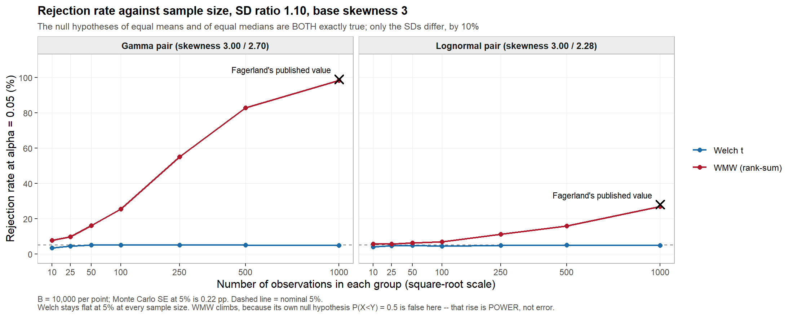

# 요약 {-}

이 문서는 3주차 과제 프롬프트(Fagerland 2012 재현)가 실제 분석으로 어떻게 바뀌었는지, 각 단계에서 무엇을 실행해 어떤 수치를 얻었는지, 그리고 현재 결과에 남아 있는 한계가 무엇인지를 기록한다. 완성된 통계 보고서는 [report_v2.html](../report_v2.html)(원본 [report_v2.Rmd](../report_v2.Rmd))에 있다. 초판 [report.html](../report.html)은 커밋 그대로 보존했고, 초판과 v2의 차이는 [CHANGES_v2.md](../CHANGES_v2.md)에 정리했다. 이 문서는 보고서가 만들어진 **과정과 문제점**을 다룬다.

**핵심 결과**

1. 평균과 중앙값이 같고 표준편차만 10% 다른 치우친 쌍에서 Welch의 기각률은 명목 5%를 지키고(각 군 100명 이상, 4.3–5.9%), WMW의 기각률은 표본크기와 함께 오른다. 논문의 대표 조건(왜도 3, SD비 1.10, 각 군 1,000명)에서 주 구성의 WMW/Welch는 gamma 98.4%/4.9%, lognormal 27.0%/4.7%이다(논문 99%/5.1%, 28%/4.9%).
2. **프롬프트가 지시한 주 구성(평균·중앙값을 정확히 같게 하는 3모수 편이족)은 논문의 표를 재현하지 못한다.** 평균·왜도·SD비를 맞추고 중앙값을 포기한 구성(민감도 B, `Y = 평균 + r(X − 평균)`)이 논문 표 2를 반올림 수준으로, 표 4·5를 각 군 50명 이상에서 0.4%p 이내로 재현한다(각 군 25명 이하는 WMW 근사 방식 차이로 벗어난다). 주 구성은 프롬프트대로 유지했고 민감도 B는 별도로 표시했다.
3. 편이 감마족은 왜도 3.748(형상모수 0.2847)에서 도달 가능한 표준편차가 최소가 되어 방향이 뒤집힌다. 왜도 4 감마 열은 주 구성으로 재현할 수 없다.
4. 개발 중 실제로 잡힌 오류가 여러 건 있었고(4장), 마지막 시각 점검에서 그림 결함 3건을, 문서화 과정에서 보고서 서술의 과장 2건을 추가로 찾아 v2에서 고쳤다.

**아직 열려 있는 문제** (7장에 상세)

- n=10에서 연속성 보정 근사와 정확검정이 칸별로 완전히 같아서, 논문이 둘 중 어느 쪽을 썼는지는 기각률만으로 구분할 수 없다(v2 보고서 문구는 이 점을 반영해 고쳤다). 규칙 4를 유지할지는 아직 결정이 필요하다.
- 논문 보충자료(Additional file 1)에 접근하지 못해, 448칸 전체를 논문의 칸별 값과 대조하지 못했다.
- 비어 있는 `results/`에서 처음부터 끝까지 한 번에 다시 실행해 본 적이 없다.

---

# 1. 이 문서의 목적

프롬프트는 "제대로 하거나 하지 말라"는 단서와 함께 10개의 하드 룰, 10개의 작업, 프로젝트 레이아웃, 보고 형식을 명시했다. 이 문서는 다음 질문에 답한다.

- 프롬프트의 각 요구를 어떤 검사 가능한 규칙으로 바꿨는가
- 각 작업에서 무엇을 실행했고 무엇이 예상과 달랐는가
- 지시(과제 안내서 포함)와 다르게 결정한 것은 무엇이고 왜 그랬는가
- 어느 규칙을 지켰고 어느 규칙과 긴장 관계가 있는가
- 지금 결과를 인용할 때 무엇을 조심해야 하는가

---

# 2. 프롬프트에서 결과까지의 흐름

## 2.1 프롬프트의 구성

프롬프트의 문구를 의미가 바뀌지 않도록 줄이면 다음과 같다.

> 두 PDF(과제 안내서와 Fagerland 논문)를 처음부터 끝까지 읽고 나서 코드를 쓴다. 과제 전체는 한 문장에 달려 있다. **WMW 검정의 귀무가설은 P(X<Y)=0.5이지 "중앙값이 같다"가 아니다.** 수치를 지어내지 말고, 논문에 맞추려고 조작하지 말고, 실행한 것만 보고하라. 없는 입력(2주차 NHANES)은 저장소에서 찾고 없으면 물어라. 안내서가 틀렸거나 불가능하면 명시하고 결정을 설명하라.

이를 다음 세 층으로 나눠 다뤘다.

| 층 | 내용 | 다룬 방식 |
|---|---|---|
| 하드 룰 10개 | 날조 금지, 조작 금지, Welch 기본, `exact=FALSE, correct=FALSE`, 정규성 검정 금지, 공통난수, 재현성, 실행 후 보고, 없으면 질문, 스펙 변경 명시 | 각각 코드·로그로 강제하거나 검사 가능한 형태로 바꿈(2.2절) |
| 작업 10개 | 빠른 구현, Satterthwaite, 분포 구성, 이분산 정규, 448칸 격자, 반례, 순열·대응·효과크기, NHANES, 그림, 보고서 | 번호가 붙은 R 스크립트 하나씩(`R/00`–`R/08`) |
| 보고 형식 | 단계마다 실행 내용·핵심 수치·불일치·스펙 이탈을 보고, 낙관적 표현 금지, 깨진 것부터 앞세움 | 진행 중 메시지와 최종 보고에 반영 |

## 2.2 하드 룰을 검사 가능한 규칙으로 바꾼 방식

| 규칙 | 실행 가능한 형태 | 근거 파일 |
|---|---|---|
| 1. 수치 날조 금지 | 보고서의 모든 수치를 `.rds` 캐시에서 인라인 R 코드로 읽어 옴. 논문 값은 비교 대상으로만 사용 | `report.Rmd`, `results/*.rds` |
| 2. 논문에 맞추기 금지 | 주 구성은 프롬프트가 정한 대로 고정. 논문과 가까운 다른 구성은 "민감도"로 라벨링하고 주 구성을 대체하지 않음 | `R/02_distributions.R`, `R/04_main_grid.R` |
| 3. Welch 기본 | `welch_p()`가 기본, Student는 `student_p()`로 분리해 비교용으로만 사용 | `R/00_utils.R` |
| 4. `exact=FALSE, correct=FALSE` | 자체 `wmw_p()`를 이 설정과 같은 식으로 구현하고 `wilcox.test`와 대조 | `R/00_validate_utils.R` |
| 5. 정규성 검정 금지 | Shapiro–Wilk 등을 어디에서도 호출하지 않음. Q-Q plot만 사용 | `R/08_figures.R` |
| 6. 공통난수 | `three_p(x, y)`가 한 표본 쌍에서 세 p값을 함께 계산 | `R/00_utils.R` |
| 7. 재현성 | 격자 칸마다 L'Ecuyer-CMRG 스트림 1개, `sessionInfo()` 저장, 재실행 감사 | `make_streams()`, `R/99_verify_cache.R` |
| 8. 실행 후 보고 | 모든 단계를 실제로 실행하고 로그를 `results/*_log.txt`에 저장 | `results/` |
| 9. 없는 입력은 질문 | NHANES를 `2nd_weeks/data/`에서 찾아 사용. 대체 자료 없음 | `R/07_nhanes.R` |
| 10. 스펙 변경 명시 | 안내서 오류와 이탈을 보고서 마지막 표에 정리 | `report.Rmd` 11장 |

## 2.3 작업과 산출물의 대응

| 작업 | 핵심 산출물 |
|---|---|
| 1. 빠른 구현 | `R/00_utils.R`, `R/00_validate_utils.R`, `results/00_utils_validation.rds` |
| 2. Satterthwaite | `R/01_verify_satterthwaite.R`, `results/01_satterthwaite.rds` |
| 3. 분포 구성 | `R/02_distributions.R`, `results/02_distributions.rds`, `results/02_log.txt` |
| 4. 이분산 정규 | `R/03_hetero_normal.R`, `results/03_hetero_normal.rds` |
| 5. 448칸 격자 | `R/04_main_grid.R`, `results/04_main_grid.rds`, `results/04_main_grid_sensB.rds`, `R/04b_smalln_wmw_variant.R` |
| 6. 반례 | `R/05_counterexamples.R`, `results/05_counterexamples.rds` |
| 7. 순열·대응·효과크기 | `R/06_permutation_effectsize.R`, `results/06_permutation_effectsize.rds` |
| 8. NHANES | `R/07_nhanes.R`, `results/07_nhanes.rds` |
| 9. 그림 | `R/08_figures.R`, `figs/*.png`(11장, 초판) / `R/08_figures_v2.R`, `figs/v2/*.png`(수정본) |
| 10. 보고서 | `report.Rmd`, `report.html`(초판) / `report_v2.Rmd`, `report_v2.html`(수정본) |
| (추가) 재현성 감사 | `R/99_verify_cache.R` |

## 2.4 전체 흐름

```text
프롬프트 → 두 PDF 정독(안내서는 CP949 문자 깨짐을 PyMuPDF로 복구)
  → 스캐폴드와 빠른 구현 + base R 대조(500설계)
  → Satterthwaite 검증(자유도·p값·네 성질)
  → 분포 구성: 64쌍 적합, 잔차 검사 → 감마 버그 적발 → 전환점 발견
  → 논문 표 2와 대조 → 민감도 B가 재현함을 발견
  → 이분산 정규 기준선
  → 448칸 예비(B=500, 19.9초) → 본 실행(B=10,000, 7.5분) → 민감도 B 실행
  → n=10 불일치 진단(04b)
  → 반례 A·B → 정수 오버플로 발견·수정
  → 순열·대응·효과크기 → NHANES(survey 참조 포함)
  → 그림 11장 → 보고서 렌더링
  → 재현성 감사(5칸 비트 단위 일치)
  → 토큰 소진으로 중단 후 재개 → 상태 확인·재렌더링·커밋
  → 최종 시각 점검에서 그림 결함 3건 발견·수정
```

---

# 3. 실제 분석 순서와 결과

## 사전 작업

- 두 PDF를 끝까지 읽었다. 논문은 `pdftotext`로 추출했다. 안내서는 한글이 깨져서 `pymupdf`로 추출한 뒤 UTF-8 파일로 저장해 읽었다.
- 환경: R 4.6.1(저장소 안에 설치, PATH에 없음), 8코어. 한글 경로 때문에 Bash에서 `Rscript.exe`를 부르면 아무 출력 없이 끝나므로 R 실행은 PowerShell로 했다.
- 설치한 패키지: knitr, rmarkdown, patchwork, dplyr, tidyr. 이 중 실제로 쓴 것은 knitr와 rmarkdown뿐이다(나머지 셋은 설치만 했고 코드에서 호출하지 않는다). 그림에는 ggplot2, scales, boot, 설계 기반 검정에는 survey를 썼다.
- 두 PDF가 프로젝트 최상위에 있어서 프롬프트가 말한 `docs/`로 옮겼다.

## 작업 1 — 빠른 구현

`welch_p`, `welch_df`, `student_p`, `wmw_p`(순위합→U→동점 보정 분산의 정규근사, 연속성 보정 없음), 효과크기(Cohen's d, Hedges' g, Glass's Δ, Cliff's δ, CLES)를 직접 구현했다.

- 무작위 설계 **500개**(요구는 200개 이상, 그중 166개는 동점이 많도록 반올림)에서 base R과 대조했다. 최대 절대 차이는 자유도 8.5e-14, p값은 4e-16 이하였다.
- Cliff's δ = 2U/(n₁n₂) − 1을 쌍 전수 계산과 대조해 1.7e-16 이내로 확인했다.
- **개발 중 발견한 오류:** `n1 * n2`가 정수 곱이라 n이 약 4.6만을 넘으면 오버플로가 났다. 반례 A의 400만 개 난수 검증에서 `NA`로 드러났고 `as.numeric()`으로 고쳤다. 이후 검증을 다시 통과했다.

## 작업 2 — Satterthwaite 자유도

- 500개 설계에서 `t.test()`와 자유도 최대 오차 1.1e-13, p값 최대 오차 3.3e-16.
- 네 성질을 코드로 확인: 범위(20,000건 극단 스트레스 포함), 한쪽 분산이 압도할 때 그 군의 n−1로 수렴(분산비 1e8에서 소수점 넷째 자리까지), n₁=n₂이고 s₁=s₂일 때 n₁+n₂−2, ν는 확률변수(고정 설계 n=15/25, SD 1/3에서 관측 범위 25.24–38.00, 상한 38은 실제로 도달).
- 소수 자유도의 이유(카이제곱 가중합의 적률 적합)는 보고서 3.1절에 서술했다.

## 작업 3 — 분포 구성 (이 과제에서 가장 많이 걸린 부분)

**구성.** 기준 X는 중앙값 1인 lognormal/gamma(목표 왜도 1–4), Y는 3모수 편이족으로 평균·중앙값을 X와 정확히 같게, 표준편차를 비율×SD(X)로 맞췄다(비율 8단계, 총 64쌍). 왜도는 결과로 받아들였다(제약 4개, 모수 3개).

**해석적 정리.** `optim`이 아니라 1차원 `uniroot`로 풀린다. 중앙값·평균 조건으로 A를 소거하면 k에 대한 방정식 하나가 남고, 근이 두 개다(황금비에서 최소). 기준분포로 연속 수렴하는 가지를 택했다.

**"잔차가 크면 즉시 실패" 규칙이 실제로 작동했다.** 첫 실행에서 감마 32쌍이 실패했다. `fit_shifted_gamma()`가 이동량을 중앙값이 아니라 평균 조건으로 잡은 버그였고, 잔차 표에서 `err_mean = err_median`이라는 특징적 패턴으로 바로 특정했다. 근찾기 잔차는 1e-16이었는데 중앙값만 틀려 있었다. 수정 후 64쌍 모두 통과(최대 잔차 1.7e-12).

**전환점 발견.** 감마 왜도 4 열에서 `P(X<Y)`가 0.5의 반대편으로 넘어갔다. 원인은 코딩 오류가 아니라 수학적 성질이다. 평균·중앙값을 고정하면 도달 가능한 SD가 형상모수 0.2847(왜도 3.748)에서 최소가 되고, 왜도 4 기준분포(형상모수 0.25)는 그 너머에 있다. 로그정규의 전환점은 왜도 5.874라 네 수준 모두 안전하다. 그 결과 감마 왜도 4에서는 Y를 넓힐수록 Y가 더 치우친다(왜도 4.68 → 7.26).

**안내서 참조표 재현(왜도 3 lognormal).** gamma, sdlog, SD, 왜도 네 열은 인쇄된 자릿수까지 일치한다. meanlog 열만 최대 9e-4 어긋나는데, 안내서가 인쇄한 gamma 열로 log(1−γ)를 역산하면 내 값과 일치한다. 즉 안내서 표가 자기 자신과 모순된다.

**논문 표 2와의 대조(논문 라벨로 환산).**

| 구성 | 감마 최대 차이 | 로그정규 최대 차이 |
|---|---:|---:|
| 주 구성 (평균·중앙값 동일) | 0.259 | 0.040 |
| 민감도 B (평균·왜도·SD비 동일, 중앙값 이동) | 0.006 | 0.012 |

민감도 B는 64칸 전부에서 논문과 최대 0.006(감마)·0.012(로그정규)만 다르다. 논문이 2자리로 인쇄했으므로 반올림 오차가 ±0.005인 점을 감안하면 반올림 수준에 가깝다. 주 구성은 프롬프트가 정한 대로 유지했다.

**라벨 방향.** 논문은 X가 넓은 쪽(`P(X<Y)>0.5`)이고 프롬프트는 Y가 넓은 쪽이다. 연속분포라 `P_논문 = 1 − P_프롬프트`이며 비교 표는 모두 논문 라벨로 환산했다.

## 작업 4 — 이분산 정규 기준선

25칸(군 크기 분할 5 × SD비 5), 총 N=50, B=10,000. 네 가지 예상이 모두 성립했다: 작은 군의 SD가 클 때 Student 팽창(최대 29.5%), 큰 군의 SD가 클 때 보수적(최소 0.1%), Welch 4.6–5.4%, 동일 n에서 Student 4.7–5.7%. 예상 밖으로 **WMW도 이분산+불균등 n에서 0.8–15.4%로 무너졌다.** "비모수면 안전하다"는 통념의 반례다.

## 작업 5 — 448칸 격자

| 실행 | 설정 | 소요 시간 |
|---|---|---:|
| 예비 | B=500 | 19.9초 → B=10,000 추정 6.6분 |
| 주 구성 | 448칸 × B=10,000 | 448.7초 (7.48분), 워커 8개 |
| 민감도 B | 448칸 × B=10,000 | 468.2초 (7.80분) |

**시드 전략.** 전체 루프 앞에서 한 번 고정하는 대신 **칸마다** 독립 스트림 하나(단일 시드에서 `nextRNGStream()`으로 448개 생성)를 배정했다. `clusterSetRNGStream` + 부하분산은 작업 배정 순서에 따라 결과가 달라지지만, 칸별 스트림은 워커 수·순서와 무관하게 재현된다.

**결과(WMW/Welch 기각률).**

| 조건 | 주 구성 | 민감도 B | 논문 |
|---|---|---|---|
| 감마 왜도 3, SD비 1.10, n=1000 | 98.4% / 4.9% | 99.1% / 5.3% | 99% / 5.1% |
| 로그정규 같은 조건 | 27.0% / 4.7% | 26.7% / 4.6% | 28% / 4.9% |
| 표 4 평균, 감마 WMW n=1000 | 67.56 | 74.72 | 74.7 |
| 표 4 평균, 로그정규 WMW n=1000 | 39.94 | 54.27 | 54.3 |
| 표 5, 감마 n=1000 | 87.1 | 90.4 | 90.3 |

민감도 B는 표 4에서 n≥25의 모든 칸이 0.31%p 이내(n≥50은 0.17%p 이내), 표 5에서 n≥50의 모든 칸이 0.4%p 이내로 논문과 일치한다. 표 5의 n=25는 0.6–0.9%p, **n=10은 3.5–4.4%p** 벗어나고 표 4의 n=10도 체계적으로 높았다(감마 10.90 대 9.47, 로그정규 6.26 대 5.21).

**n=10 진단(04b).** 네 가지 WMW 변형(`exact=FALSE,correct=FALSE`, 연속성 보정 근사, R 기본값, 정확검정)으로 n=10 행만 재실행했다. 연속성 보정 근사·R 기본값·정확검정은 64칸 모두에서 칸별로 완전히 같았고(최대 차이 0.000%p), 논문의 9.47/5.21과 0.02%p 이내로 일치했다. 프롬프트의 `correct=FALSE`만 1.0–1.5%p 부풀린다. 이 해석의 한계는 7.1절에 적었다.

**Welch의 n=10 특성.** 각 군 10명에서는 Welch도 1.6–5.3%로 보수적이다(평균 3.96%, 논문 표 4의 4.01%와 일치, 가장 낮은 칸은 감마 왜도 4). 100명 이상에서는 4.3–5.9%다.

## 작업 6 — 반례

**반례 A(최소 구성).** `P(X<Y)=0.275`를 손으로 유도(0.25×(0.05+1+0+0.05))하고 400만 개 난수로 0.27460을 얻었다(몬테카를로 SE 0.00022). Cliff's δ는 0.45044(이론 0.45), 각 군 20명에서 WMW 71.9%. **약점:** 평균이 ±2.25로 크게 달라 Welch도 99.7% 기각한다. "WMW는 중앙값 검정이 아니다"만 증명하고 역설은 증명하지 못한다.

**반례 B(논문형).** 평균 1.29178, 중앙값 1이 정확히 같고 SD비 1.10인 편이 로그정규 쌍. 정확한 `P(X<Y)=0.482533`(안내서 0.4824). 각 군 1,000명에서 WMW 27.23%, Welch 4.81%(B=10,000, 안내서는 B=2,000에 WMW 30.0%).

**안내서 스니펫의 공통난수 버그.** 안내서 반례 B 코드는 `rX(n)`, `rY(n)`을 검정마다 따로 호출해 두 검정이 서로 다른 표본을 본다. 공통난수로 고쳤고 그 비용을 측정했다: `P(p_WMW<p_Welch)`가 n=1000에서 75.8%(공통난수) 대 71.0%(독립표본), 추정 분산 비가 1.52배(40회 반복 기준).

**결론 표현.** 30%는 오류율이 아니라 WMW 자신의 귀무가설 `P(X<Y)=0.5`(반례 B에서 거짓)에 대한 검정력이다. 틀린 것은 검정이 아니라 그 p값을 "중앙값이 다르다"로 번역한 해석이다.

## 작업 7 — 순열·대응·효과크기

- **원자료 평균차 순열검정은 이분산+불균등 n에서 무효**: n=10:40, SD 3:1에서 24.8%(Student 25.3%와 동일하게 거동). Welch 통계량을 치환하는 스튜던트화 순열검정은 5.75%로 회복. p값은 (1+극단)/(B+1).
- **순위 순열검정 = WMW**: C(13,6)=1,716개 분할을 전수 열거해 `wilcox.test(exact=TRUE)`와 5.6e-17 이내로 일치. 근사가 아닌 항등식.
- **대응 구조**: Var(d)=σ₁²+σ₂²−2ρσ₁σ₂를 이론값과 최대 0.03 차이로 확인. ρ가 −0.5→0.9로 갈 때 대응 t 검정력이 35.9%→95.0%, 독립 검정은 48% 안팎. 이름은 끝까지 순위합(독립)과 부호순위(대응)로 구분했다.
- **효과크기(반례 B)**: n이 25→1,000으로 40배 커져도 Cliff's δ는 약 0.035로 사실상 일정하고, WMW p값의 중앙값만 0.49→0.17로 떨어진다.

## 작업 8 — NHANES

- 입력: `2nd_weeks/data/analytic_sample_v2.rds`(23,389행)를 찾아 사용했다. 대체 자료는 쓰지 않았다.
- 변수: 중성지방(LBXTR, 표본왜도 남 7.1 / 여 19.8)과 HDL(LBDHDD, 왜도 1.4 / 1.1), 군 분할은 성별.
- 결측 처리는 완전사례. LBXTR 10,684명(54.3% 제외, 공복 부표본 설계 때문), LBDHDD 22,126명(5.4% 제외).
- 전체표본: 중성지방 Welch p=5.2e-26, WMW p=1.8e-28. Welch 평균차 21.27 mg/dL인데 Hodges–Lehmann 추정은 11.00으로 거의 절반이다.
- `survey::svyttest` 참조: 설계 자유도 71, 중성지방 평균차 22.44, HDL −10.95.
- **예상과 달랐던 점:** 부분표본 실험에서 중성지방은 각 군 2,500명 전까지 Welch의 p값이 더 작았고(P(p_WMW<p_Welch)=36.8–42.8%), HDL은 반대로 WMW가 압도했다. 논문의 결과는 귀무가설이 참일 때의 것이므로 귀무가 거짓인 이 자료로 옮겨지지 않는다.

## 작업 9 — 그림

11장(`figs/`): 군별 Q-Q, 재표본 분포, CLT 패널, CI 병치 두 장(평균 구간 / Hodges–Lehmann 별도), 제1종 오류 격자 두 장(감마·로그정규), 표본크기별 기각률, 이분산 정규 격자, NHANES 부분표본, Satterthwaite 자유도 분포.



**시각 점검.** 초판 커밋 후 11장을 모두 직접 열어 보았고 결함 3건(fig1, fig2a, fig5)을 찾았다(4장 표). 초판 그림은 커밋 그대로 두고, 수정본을 `figs/v2/`에 새로 만들었다. 수정한 fig1, fig2a, fig5는 수정 후 다시 열어 확인했다. 나머지 8장은 초판 버전을 확인했고, v2 스크립트가 난수를 소비하는 코드 경로를 바꾸지 않았으므로 같은 그림일 것으로 보이나 v2 판을 픽셀 단위로 비교하거나 다시 열어 보지는 않았다.

## 작업 10 — 보고서

`report.Rmd`를 rmarkdown으로 렌더링해 `report.html`(약 2.4 MB, 자체 완결형, 그림 11장 포함, 표 35개)을 만들었다. 이후 결함 수정본은 새 파일 `report_v2.Rmd`/`report_v2.html`로 만들었다. quarto CLI가 없어서 프롬프트가 허용한 `.Rmd`를 썼다. 모든 수치는 `.rds`에서 인라인 R 코드로 가져온다.

## 재현성 감사와 작업 재개

- `R/99_verify_cache.R`: 격자 5칸(대표 조건, 뒤집히는 감마 왜도 4 칸, 최소·최대 n 칸)을 현재 코드로 재실행해 캐시와 대조했다. **차이가 정확히 0**이었다. `04b`를 재실행한 결과도 수정 전과 차이 0이었다. 칸별 스트림 덕분에 448칸 전체를 다시 돌리지 않고 칸 하나만 검증할 수 있었다.
- 작업 도중 토큰이 소진되어 세션이 중단되었다. 재개 시 스크립트·캐시·그림·보고서 파일이 모두 남아 있는지 확인하고, 마지막에 수정한 `report.Rmd`만 다시 렌더링한 뒤 커밋했다.

---

# 4. 개발 중 발견한 오류와 수정 기록

| # | 오류 | 발견 경로 | 수정 | 영향 |
|---|---|---|---|---|
| 1 | 감마 편이 이동량을 중앙값이 아닌 평균 조건으로 계산 | 잔차 표(`err_mean = err_median`) | `gamma = med − θ·qgamma(0.5,k)` | 32쌍 실패 → 전부 통과 |
| 2 | `n1*n2` 정수 오버플로(n>4.6만) | 반례 A의 400만 난수에서 Cliff's δ가 NA | `as.numeric()` | 격자 결과는 영향 없음(캐시 감사로 확인) |
| 3 | 감마 왜도 4에서 방향 반전 | Table 2 대조에서 0.26 이탈 | 코드 오류가 아니라 수학적 한계임을 규명, 보고서에 명시 | 해당 열 재현 불가 |
| 4 | 그림 팔레트 이름이 요인 수준과 불일치 → Welch가 회색으로 나오고 범례에서 빠짐 | fig5 시각 점검 | 팔레트 키를 수준 이름과 일치 | 수정 |
| 5 | 히트맵 범례의 0%와 5% 라벨이 겹침 | fig4 시각 점검 | 0% 눈금 제거, 범례 막대 길이 지정 | 수정 |
| 6 | `svyttest`에서 `coef()`가 비어 있음 | NHANES 실행 오류 | `tt$estimate` 사용 | 수정 |
| 7 | 보고서 본문에 백틱이 든 인라인 코드 파싱 오류 | 렌더링 오류 | 일반 마크다운으로 교체 | 수정 |
| 8 | 수식 `k^\*`가 수식 모드에서 무효 | 렌더링 후 확인 | `k^{*}`로 교체(치환 중 인접 식이 손상되어 바로 복구) | 수정 |
| 9 | fig1 Q-Q: 12칸 중 6칸이 비고 왼쪽 라벨이 잘림 | 커밋 후 시각 점검 | 칸별 1패널의 `facet_wrap`으로 재구성 | v2에서 수정, 재확인 |
| 10 | fig2a: 그림은 부트스트랩이 왼쪽인데 캡션은 "왼쪽=순열" | 커밋 후 시각 점검 | 패널 순서를 명시하고 캡션에 패널 이름 사용 | v2에서 수정, 재확인. 이제 순열이 왼쪽이라 보고서 캡션과도 일치 |
| 11 | fig5: "Fagerland's published value" 라벨이 곡선과 겹침 | 커밋 후 시각 점검 | 라벨을 곡선 위로 이동 | v2에서 수정, 재확인 |
| 12 | 결론 1번이 Welch를 "모든 표본크기에서 5% 부근"이라고 서술했으나 n=10에서는 1.6–5.3% | 렌더링 결과를 읽다가 발견 | 서술을 n≥100과 n=10으로 분리 | 수정 |
| 13 | 보고서가 민감도 B를 "표 4·5의 n≥25 모든 칸에서 0.3%p 이내", "전부 몬테카를로 오차 안에서 재현"이라고 서술. 실제로 표 5의 n=25는 0.6–0.9%p, n=10은 3.5–4.4%p 벗어남. 같은 문단에서 "정확검정을 그대로 썼다"고 단정하고 이를 "규칙 4가 옳다는 증거"로 해석 | 이 문서를 쓰며 표 4·5의 칸별 차이를 다시 계산해 확인 | 서술을 실제 범위(표 4 n≥25 0.31%p, 표 5 n≥50 0.4%p)로 바꾸고 "R 기본 설정과 일치, 정확검정과 연속성 보정은 구분 불가"로 완화, "규칙 4가 옳다는 증거" 문장 삭제 | v2에서 수정. 수치 자체는 바뀌지 않음 |
| 14 | 보고서 4.6절이 표 2 차이를 "반올림 오차 안"이라고 서술. 최대 차이는 감마 0.006, 로그정규 0.012로 ±0.005를 넘음 | 위와 같은 재점검 | "논문 값 가까이, 반올림 수준"으로 완화 | v2에서 수정 |

---

# 5. 안내서 오류와 지시에서 벗어난 점

## 안내서의 문제

| 문제 | 내용 | 처리 |
|---|---|---|
| 공통난수 버그 | 반례 B 스니펫이 검정마다 표본을 따로 뽑음(안내서 스스로 아래 주석에서 공통난수를 요구) | 공통난수로 수정, 비용 정량화 |
| meanlog 열 모순 | 인쇄된 meanlog가 자기 gamma 열로 역산한 값과 다름(예: 0.2098 대 0.2089). 1.05 행은 자릿수 뒤바뀜으로 보임 | 내 값과 역산 값의 일치를 표로 제시 |
| 반례 B의 n=1000 값 | 안내서 30.0%(B=2,000) 대 내 27.23%(B=10,000). 손계산으로 결합 표준오차 약 1.1%p, z 약 2.5 | 원인 미규명, 7.7절에 기록 |
| 반례 B 파라미터 | 코드의 `log(1.46200)=0.37988`이 표의 0.3796이 아니라 내 값 0.3798 쪽과 맞음 | 보고서에 언급 |

## 프롬프트·레이아웃에서 벗어난 점

| 사항 | 이유 |
|---|---|
| `report.qmd` 대신 `report.Rmd` | quarto CLI 미설치. 프롬프트가 "(or .Rmd)"로 허용 |
| PDF를 `docs/`로 이동 | 프롬프트의 레이아웃이 `docs/`를 전제 |
| 레이아웃에 없는 파일 추가: `00_validate_utils.R`, `04b_smalln_wmw_variant.R`, `99_verify_cache.R` | 검증·진단 분리. 프롬프트의 파일 목록에는 없음 |
| 민감도 분석 2종 | 프롬프트 3번 작업이 허용("명확히 라벨링, 주 구성 대체 금지"). 주 구성은 유지 |
| 그림 축 라벨이 영어 | ggplot2 장치에서 한글은 플랫폼별 글꼴 지정이 필요해 재현이 깨짐. 캡션·본문은 한국어 |

---

# 6. 하드 룰 준수 현황

| 규칙 | 상태 | 근거와 단서 |
|---|---|---|
| 1. 수치 날조 금지 | 준수 | 보고서 수치는 모두 캐시에서 인라인으로 읽음. 논문 값은 표 2–5와 본문에서만 사용 |
| 2. 논문에 맞추기 금지 | 준수 | 주 구성을 바꾸지 않음. 민감도 B가 논문과 맞는다는 사실도 그대로 공개. 단 민감도 B는 논문 표 2와 비교하며 찾은 구성이라는 점을 밝힘 |
| 3. Welch 기본 | 준수 | |
| 4. `exact=FALSE, correct=FALSE` | **준수하되 논문 재현과 긴장** | 격자 전체를 이 설정으로 실행. 그 결과 n=10에서 논문보다 높게 나옴(7.1절) |
| 5. 정규성 검정 금지 | 준수 | Q-Q plot만 사용 |
| 6. 공통난수 | 준수 | 표본 하나를 세 검정에 공유, 안내서 버그 수정 |
| 7. 재현성 | 준수(단서 있음) | 칸별 스트림, `sessionInfo` 저장, 5칸 비트 단위 일치. 다만 처음부터 끝까지 재실행한 적은 없음(7.3절) |
| 8. 실행 후 보고 | 준수 | 실행하지 않은 것은 실행하지 않았다고 이 문서에 적음 |
| 9. 없는 입력은 질문 | 준수 | NHANES를 저장소에서 찾음 |
| 10. 스펙 변경 명시 | 준수 | 5장 표 |

---

# 7. 현재 문제점과 한계

## 7.1 n=10에서 "정확검정"과 "연속성 보정"을 구분할 수 없다 — 중요도 높음

보고서 초안의 요약 2번과 5.4절은 "논문은 `wilcox.test()`의 정확검정 자동 전환을 그대로 썼다"고 단정했다. 그러나 `04b` 결과에서 연속성 보정 근사, 정확검정, R 기본값이 64칸 모두에서 칸별로 같다. 따라서 n=10의 기각률만으로는 "정확검정"과 "연속성 보정 근사"를 구분할 수 없다. 증거가 지지하는 서술은 "논문의 n=10 값은 R 기본 `wilcox.test` 설정(두 군이 모두 50 미만이고 동점이 없으면 정확검정, 그 밖에는 연속성 보정 근사)과 일치한다"이다. **v2 보고서의 해당 문구는 이 서술로 고쳤다(4장 13번, `CHANGES_v2.md`).**

또 프롬프트의 규칙 4가 이 재현 불일치를 만든다는 점은 결정이 필요한 사항이다. 규칙을 유지하면 표 4 평균 기준으로 n=10에서 +1.0–1.5%p, n=25에서 약 +0.3%p가 남고, n≥50에서는 영향이 없다.

## 7.2 논문의 칸별 값과 대조하지 못했다 — 중요도 높음

논문 본문에는 표 2–5의 요약값과 대표 조건 몇 개만 있고, 448칸 전체는 Additional file 1에 있다. 이 보충자료를 받아 보려 했으나 Springer는 인증 핸드셰이크로 넘어갔고 PMC는 404, Europe PMC는 503이었다. 따라서 내 비교는 표 2·4·5의 요약값과 본문 수치에 한정되고, 448칸 전체를 논문과 대조했다고 말할 수 없다.

## 7.3 처음부터 끝까지 재실행한 적이 없다 — 중요도 중간

각 스크립트는 새 R 프로세스에서 단독 실행되지만, 비어 있는 `results/`에서 스크립트 12개를 순서대로 다시 돌려 본 적은 없다. `R/00_utils.R`을 중간에 수정했으므로 앞 단계 캐시가 낡았을 가능성이 이론상 있다. 5칸 감사와 `04b` 재실행으로 가장 큰 격자는 확인했지만, 01·02·03 캐시는 재생성해 대조하지 않았다(05·06·07은 수정 이후에 실행했다). 수정 내용은 정수 오버플로 방지뿐이라 실질적 위험은 낮다고 판단한다.

## 7.4 주 구성이 논문의 구성이 아니다 — 중요도 높음

주 구성(평균·중앙값 동일, 프롬프트 지시)의 표 3·4·5는 논문과 다르다(예: 표 4 감마 WMW n=1000이 67.56 대 74.7). 논문과 맞는 것은 민감도 B다. 보고서에는 두 구성을 나란히 제시했지만, 독자가 주 구성 표를 "논문 재현"으로 읽을 위험이 있다.

## 7.5 "논문 서술이 자기 표와 양립하지 않는다"는 추론이다 — 중요도 중간

보고서 결론은 논문의 "평균과 중앙값이 같다"는 서술이 논문의 표 2와 양립하지 않는다고 쓴다. 이는 내가 시험한 3모수 구성 중 평균 정렬만 표 2를 재현했다는 사실에서 나온 추론이다. 저자의 실제 생성 코드는 확인하지 못했으므로 다른 구성(혼합분포, 비선형 변환 등)을 배제하지 못했다.

## 7.6 감마 왜도 4 열은 재현 불가다 — 중요도 중간

전환점을 넘은 기준분포라서 주 구성에서 `P(X<Y)`가 0.5의 반대편으로 넘어간다. 이 열의 주 구성 결과를 논문과 직접 비교하는 것은 의미가 없다.

## 7.7 반례 B의 n=1000 값이 안내서와 다르다 — 중요도 낮음

안내서 30.0%(B=2,000)와 내 27.23%(B=10,000)의 차이는 손계산으로 z 약 2.5다. 보고서는 이 차이를 "대부분 난수 오차 범위"라고 서술했지만, 이 칸은 그 범위를 벗어날 수 있다. 원인(안내서 파라미터의 반올림 등)은 규명하지 않았다.

## 7.8 공통난수 효과 추정이 조악하다 — 중요도 낮음

분산비 1.52배는 B=1,000의 독립 실행 40회로 얻은 값이다. 불확실성 구간을 계산하지 않았다.

## 7.9 시뮬레이션 규모가 작은 부분이 있다 — 중요도 낮음

순열검정 표는 B_sim=2,000(표준오차 0.49%p), 효과크기 표는 반복 2,000회다. 모두 결론을 바꿀 수준은 아니지만 격자(B=10,000)보다 정밀도가 낮다.

## 7.10 CI 그림의 순열 구간이 근사적이다 — 중요도 낮음

fig3a의 순열 구간은 스튜던트화 순열검정을 뒤집어 얻는데, 평가마다 새 난수를 쓰는 잡음 있는 함수에 `uniroot`(허용오차 0.05)를 적용했다. 끝점은 근사값이다.

## 7.11 NHANES 관련 — 중요도 중간

- 표본가중치를 쓰지 않은 검정이 대부분이다. 모집단 추론에는 쓸 수 없다.
- `svyttest`는 MEC 가중치(WTCOMB)를 썼는데, 중성지방은 공복 부표본이라 올바른 가중치는 WTSAF2YR이다. 이 변수가 2주차 파일에 없어 중성지방 행은 참고용이고 표준오차가 설계상 정확하지 않다.
- 변수는 두 개, 분할은 성별 하나뿐이다.
- **재현 가능성:** `R/07_nhanes.R`이 읽는 `analytic_sample_v2.rds`는 `.gitignore`의 `**/data/*.rds` 때문에 저장소에 올라가지 않는다. 새로 클론한 사람은 2주차 자료를 재생성하기 전에는 `07`과 `08`을 실행할 수 없다.

## 7.12 그림의 남은 한계 — 중요도 낮음

- fig1의 여성 중성지방 패널은 4,233 mg/dL 관측치 하나 때문에 자료의 대부분이 바닥에 눌려 보인다. 캡션에 명시했지만 읽기 좋은 그림은 아니다.
- 축 라벨이 영어다(5장 표).
- 수정하지 않은 8장은 수정 전 버전만 확인했다.

## 7.13 보고서 자체의 한계 — 중요도 낮음

- 표 번호와 절 번호 상호 참조(예: "표 17", "§8.6")는 손으로 적었고 자동 생성이 아니다. 하나하나 대조 검증하지는 않았다.
- 단계마다 보고하라는 프롬프트 요구는 진행 중 메시지와 최종 요약으로 충족했으며, 단계별 독립 보고서를 따로 쓰지는 않았다.

---

# 8. 개선 우선순위

1. (서술은 v2에서 고침) 남은 결정: 규칙 4를 유지할지, `correct=TRUE` 변형을 별도 행으로 표시할지.
2. Additional file 1을 확보해 448칸 전체를 논문과 대조한다(칸별 값이 있으면 민감도 B 격자와 주 구성 격자에 그대로 대응한다).
3. 비어 있는 `results/`에서 스크립트 12개를 순서대로 재실행해 모든 캐시를 재생성하고 기존 결과와 대조한다.
4. 2주차 NHANES 자료를 재생성하는 절차를 `07_nhanes.R` 머리말에 명시하거나 재생성 스크립트를 연결한다. 중성지방에는 WTSAF2YR을 붙여 설계기반 분석을 다시 한다.
5. 반례 B의 n=1000 불일치를 규명한다(안내서 파라미터를 반올림 그대로 사용해 재실행).
6. 보고서의 표·절 상호 참조를 자동 생성 방식으로 바꾼다.

---

# 9. 결과를 인용할 때의 권장 표현

다음 표현은 현재 증거 수준에 맞다.

> 평균·중앙값이 정확히 같고 SD만 10% 다른 gamma·lognormal 쌍에서 Welch의 기각률은 각 군 100명 이상에서 4.3–5.9%였고 WMW는 표본크기와 함께 증가했다(왜도 3, SD비 1.10, n=1000에서 gamma 98.4%, lognormal 27.0%). 이는 WMW 자신의 귀무가설 P(X<Y)=0.5가 거짓인 상황에서의 검정력이다. 논문의 표 2는 평균·왜도를 맞추고 중앙값을 맞추지 않은 구성에서 반올림 수준으로, 표 4·5는 각 군 50명 이상에서 0.4%p 이내로 재현되었다. 논문의 칸별 전체 표와의 직접 대조는 수행하지 못했다.

다음 표현은 현재 결과보다 강하므로 피해야 한다.

> 논문이 정확검정을 사용했음을 확인했다. / 논문의 표 2·4·5를 몬테카를로 오차 안에서 전부 재현했다. / 논문의 448개 조건을 모두 재현했다. / 논문의 서술이 틀렸다.

---

# 10. 부록: 실행 순서

```text
Rscript R/00_validate_utils.R
Rscript R/01_verify_satterthwaite.R
Rscript R/02_distributions.R
Rscript R/03_hetero_normal.R
Rscript R/04_main_grid.R 500 pilot
Rscript R/04_main_grid.R
Rscript R/04_main_grid.R 10000 sensB
Rscript R/04b_smalln_wmw_variant.R
Rscript R/05_counterexamples.R
Rscript R/06_permutation_effectsize.R
Rscript R/07_nhanes.R          # ../2nd_weeks/data/analytic_sample_v2.rds 필요
Rscript R/08_figures.R            # 초판 그림 (figs/)
Rscript R/08_figures_v2.R         # 수정본 그림 (figs/v2/), report_v2.Rmd가 사용
Rscript R/99_verify_cache.R
```

시드 기준값은 20260920이며 스크립트별로 오프셋을 더해 쓴다. 병렬 실행(`04`, `04b`)은 L'Ecuyer-CMRG 스트림을 칸 번호로 배정한다.
