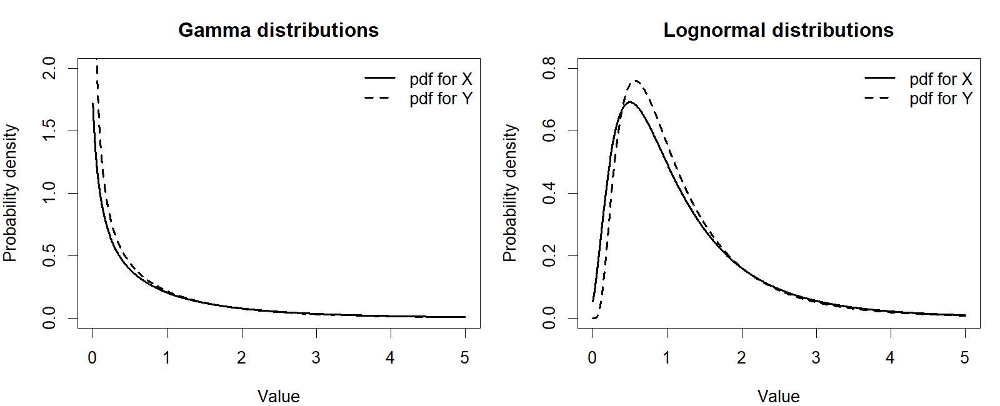
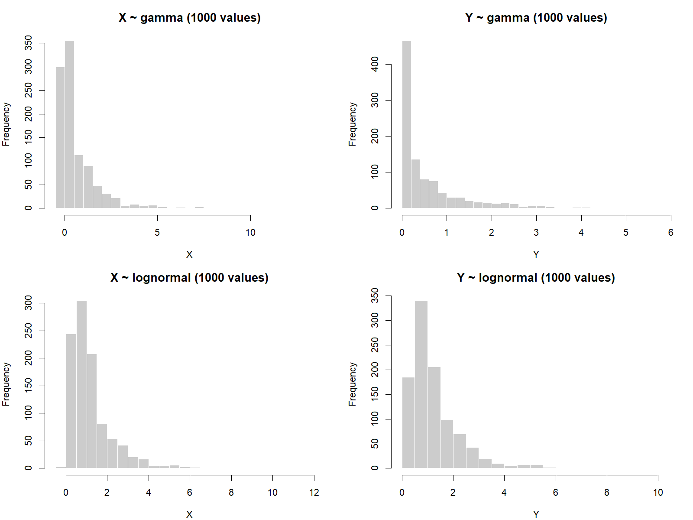
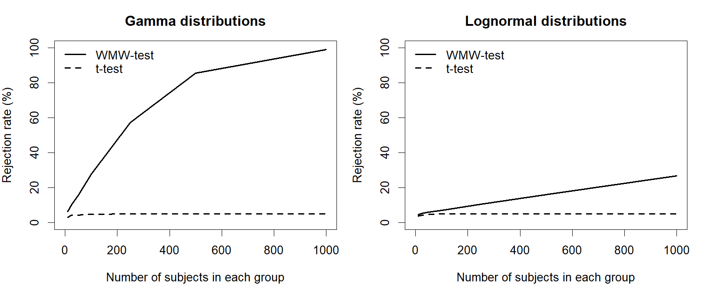
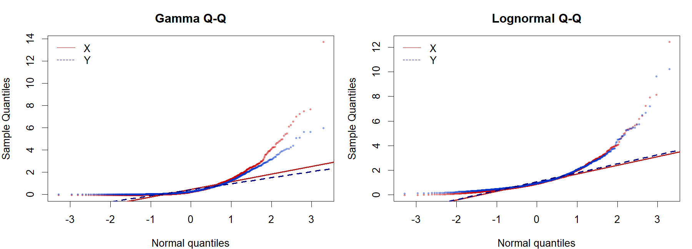
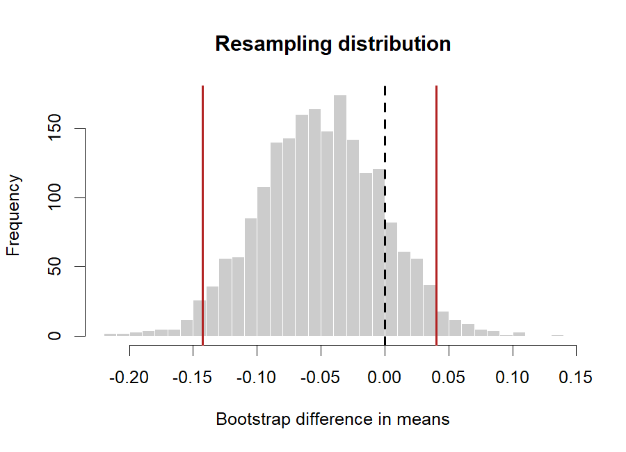
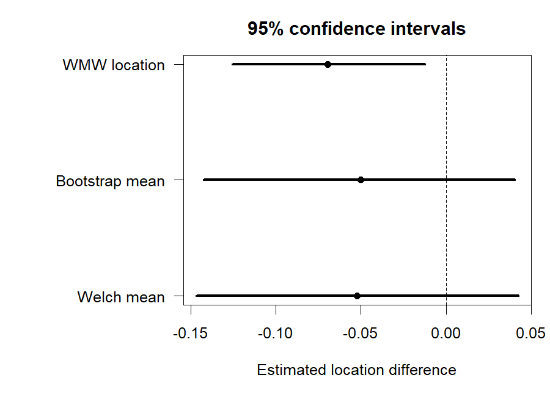
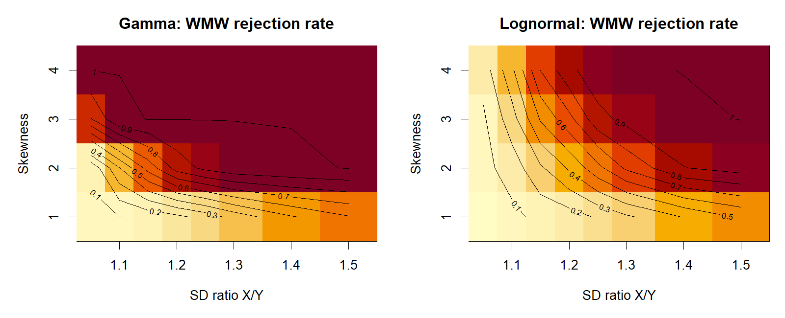

## 1. 연구 질문과 논문 요약

Fagerland (2012)의 핵심 질문은 큰 표본에서 심하게 치우친 연속형 자료를 비교할 때 Welch t 검정과 Wilcoxon–Mann–Whitney(WMW) 검정이 어떤 가설에 답하는가이다. Welch 검정은 평균 동일성을, WMW는 일반적으로 `Pr(X<Y)=0.5`를 검정한다.

## 2. 사전 가정, 실제 수치와의 차이, 수정 로그

초기에는 두 분포의 평균과 중앙값을 모두 같게 하면서 표준편차만 다르게 할 수 있다고 해석했다. 그러나 같은 왜도의 gamma 또는 lognormal 위치–척도족에서는 불가능하다. 척도를 바꾸면 평균–중앙값 간격도 변하기 때문이다.

따라서 평균 정렬과 중앙값 정렬을 각각 후보로 시험했다. 예비실험은 두 family 모두 평균 정렬을 선택했다. 이때 평균은 같지만 중앙값은 같지 않으므로, 논문의 해당 문장은 생성 규칙과 양립하지 않는다. 변경 과정, 시드, 반복수, 차이의 표준화 검정은 `results/logs/reconciliation.md`와 `results/tables/validation.csv`에 보존한다. 이는 수치 맞추기가 아니라 논문에 생략되거나 모호하게 표현된 생성 규칙을 식별하는 과정이다.

```{r validation, echo=FALSE}
if (file.exists("../results/tables/validation.csv")) knitr::kable(read.csv("../results/tables/validation.csv"))
```

## 3. 방법

- 명목 유의수준: 0.05
- 최종 반복: 조건당 10,000회
- 표본수: 군당 10, 25, 50, 100, 250, 500, 1000
- 왜도: 1, 2, 3, 4
- 표준편차 비: 1.05–1.50
- 검정: 독립 2표본 Student t, Welch t, WMW, 순열검정; 확장 분석에서 대응 t와 효과크기
- 재현성: 고정 시드, `replicate()`, 입력 PDF MD5, `sessionInfo()`

Welch–Satterthwaite 자유도는 다음과 같이 직접 계산하여 R의 `t.test(var.equal=FALSE)`와 비교한다.

\[
\nu = \frac{(s_X^2/n_X+s_Y^2/n_Y)^2}
{(s_X^2/n_X)^2/(n_X-1)+(s_Y^2/n_Y)^2/(n_Y-1)}.
\]

## 4. 논문형 시각화와 해석

### 4.1 확률밀도와 표본 히스토그램





두 군의 밀도는 육안상 비슷하지만 작은 퍼짐 차이가 있다. 큰 표본에서는 WMW가 이 작은 분포 차이를 높은 검정력으로 검출한다.

### 4.2 표본수별 기각률



Welch 기각률은 평균 동일성 하에서 약 5%를 유지한다. WMW 기각률은 표본수가 커질수록 증가하며, 이는 제1종 오류라기보다 `Pr(X<Y)≠0.5`에 대한 검정력으로 해석해야 한다.

### 4.3 Q-Q plot, 재표본 분포와 신뢰구간







Q-Q plot의 꼬리 이탈은 원자료의 비정규성을 보여 주지만, 큰 표본에서 평균의 표집분포가 정규 근사되는 것과 모순되지 않는다. Welch와 bootstrap 평균 차이 구간은 같은 추정대상을 다루지만, WMW 위치 구간은 순위 기반의 다른 추정대상을 다룬다.

### 4.4 제1종 오류율/기각률 격자



WMW의 기각률은 왜도와 표준편차 비가 커질수록 증가한다. 따라서 이 그림을 평균 또는 중앙값 동일성에 대한 제1종 오류율로만 부르는 것은 주의가 필요하다.

## 5. 중앙값 동일 반례

왜도 4인 gamma 두 군의 모집단 중앙값을 같게 하고 X의 표준편차를 10% 크게 두면 중앙값은 같지만 `Pr(X<Y)`는 약 0.541이다. 따라서 WMW는 큰 표본에서 유의할 수 있다. 이 반례에서는 평균은 같지 않으므로, WMW의 유의성을 “중앙값 차이”로만 해석할 수 없다는 점을 보여 준다. 수치 결과는 `results/tables/05_counterexample.csv`에 기록한다.

## 6. NHANES 확장 분석

`data/raw/nhanes_week2.rds`가 제공되면 같은 검정·효과크기·진단 도표를 적용한다. 현재 원자료가 없어 이 절은 실행 보류 상태다.

## 7. 한계와 결론

논문은 정확한 난수 생성 코드와 정렬 규칙을 제공하지 않았고, 본문의 “평균과 중앙값이 모두 같다”는 서술은 위치–척도족의 성질과 충돌한다. 따라서 본 재현은 논문 수치가 지지하는 family별 정렬 규칙을 명시적으로 사용한다. Welch 검정은 평균 동일성에서 약 5%를 유지하지만, WMW는 다른 귀무가설에 답하기 때문에 큰 표본에서 높은 기각률을 보인다.
