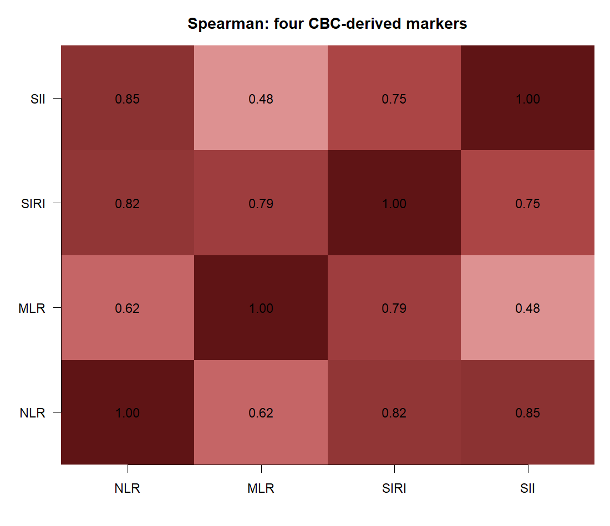

---
tags:
  - 염증과노쇠
  - 논문적용
순서: 5
---

# 02 논문에서 네 지표를 만든 방법

<!-- V2-LEARNING-STAGE-02 -->

> 읽는 순서: **논문 설명 → 남긴 의문 → 구현 → 재현 비교 → 추가 검토 → 갱신된 해석**. 개념이 막히면 위 통계 개념 노트로 돌아가세요.

## 1. 처음의 논문 설명과 데이터 흐름

> 아래는 구현 전에 작성한 원문 해설입니다. 당시의 미실행 설명은 이 구역의 작성 시점을 뜻하며, 이후 실제 실행 상태는 3–6구역에서 확인합니다.

[[00-start 처음부터 따라가는 분석 흐름|전체 흐름]] · [[02-concept 02 염증을 무엇으로 측정하는가|통계 개념 배우기]]

> 논문 사실: CRP·IL-6가 아니라 CBC에서 계산한 네 지표를 주 설명변수로 사용했습니다.

### 원자료에서 설명변수로

| 지표 | 식 | 예시 F: N=4.8, L=2.0, M=0.6, P=250 |
|---|---|---:|
| NLR | N/L | 2.4 |
| MLR | M/L | 0.30 |
| SIRI | N×M/L | 1.44 |
| SII | P×N/L | 600 |

F의 M과 P는 계산 설명을 위해 추가한 가상 측정값입니다. 세포 수 단위는 10³/μL이며 NLR·MLR은 단위 없는 비율, SIRI·SII는 계산에 사용한 세포 수의 단위를 따릅니다.

### 선택 이유와 검증된 범위

저자들은 CBC 기반 지표가 구하기 쉽고, 기존 연구의 인구집단·지표 범위를 넓히려 했다고 설명합니다. 특히 SIRI와 FI의 연관성을 검토하는 점을 강조합니다. **이 연구는 네 지표를 CRP나 IL-6와 직접 비교하여 우수성을 판정한 연구가 아닙니다.** 그러므로 ‘대표 염증지표 네 개이므로 염증 전체를 설명한다’고 읽으면 과장입니다.

또한 네 지표는 공통 재료를 사용합니다. 예를 들어 SIRI=NLR×M, SII=NLR×P입니다. 서로 독립적인 염증 원인 네 가지가 아닙니다. 한 모형에 모두 넣으면 중복 정보와 공선성 문제를 검토해야 합니다. 원문은 지표별 OR를 제시하며, 네 지표를 동시에 투입했다는 명확한 설명은 없습니다. 따라서 네 지표 간 상호 보정까지 수행했다고 가정하지 않습니다.

### 재현할 때 추가 확인할 것

림프구가 0이거나 극단적으로 작으면 비율 계산과 로그변환에 문제가 생깁니다. 단위, 검출한계, 0·이상값 처리 규칙을 확인해야 합니다. **이는 재현 시 확인할 사항이지, 논문이 구체적으로 수행했다고 보고한 절차는 아닙니다.**

근거: [원문 PDF 2쪽의 CBC 지표 정의와 연구 배경](assets/paper.pdf#page=2).

이제 각 사람의 X가 생겼습니다. 다음에는 노쇠의 측정법인 Fried와 FI를 비교하고, 이 논문이 FI를 선택한 이유를 확인한 뒤 결과변수 Y를 만듭니다. 지표의 선택은 염증 X뿐 아니라 노쇠 Y에도 필요한 과정입니다.

## 2. 이 단계에서 남겨 둔 의문

**같은 혈구 수에서 만든 네 지표가 독립적인 증거인가?**

NLR·MLR·SIRI·SII는 세포 수를 공유한다. 기존 후보 자료의 상관 계산을 재사용한다.

> 문제 `ISSUE-02` · 종류: 통계적 타당성 · 연결 작업: `V2-E01`. 기록 ID를 몰라도 아래 설명을 읽을 수 있습니다.

## 3. 어떻게 구현했고 무엇을 얻었나

<!-- V3-STAGE-02 -->

### 후속 실행: 남은 논문 분석까지 구현

혈구 지표의 수식을 바꾼 것이 아닙니다. 이번 변화의 출발점은 결과변수 FI를 만들 때의 설문 분기와 대상자 선정입니다. 네 지표는 동일 혈구 성분을 공유하므로 네 개의 독립된 생물학적 증거로 세지 않습니다. 기존 수식 검증·상관 분석은 그 정의 범위에서 재사용합니다.

> 아래의 기존 V2 실행 내용은 당시 완비 후보의 기록입니다. 이번 후보와 표본·정의가 같다고 섞어 읽지 않습니다.

### 구현·검토: 같은 혈구에서 만든 지표를 독립 증거로 세지 않기

**입력 → 구현:** CBC 수치를 개인별 SEQN으로 결합했습니다. 림프구가 양수일 때 NLR=N/L, MLR=M/L, SIRI=N×M/L, SII=P×N/L을 계산했습니다. 로그 모형은 양수 지표만 사용합니다. 단위와 코드북은 [자료 출처와 주의점](assets/analysis-20260928/runs/S02-nhanes-data/data_provenance_and_caveats.json)에 연결했습니다.

**검토 결과:** 실제 분석 표본에서 Spearman 상관은 NLR–SII=0.851, NLR–SIRI=0.822, MLR–SIRI=0.787입니다. 분자·분모를 공유하므로 네 결과를 서로 독립적인 네 번의 입증으로 세면 안 됩니다. 각 지표를 하나씩 넣은 모형을 실행했고, 네 지표를 한 모형에 동시에 넣어 독립 효과를 분해했다고 주장하지 않습니다.

**추가 질문의 처리:** FI 자체에도 혈소판 결핍 항목이 있습니다. 같은 사람에서 해당 항목을 빼고 35로 나눈 FI를 분석하는 추가 작업을 실행했습니다([[10-paper 10 Figure를 통해 결론의 범위 정하기|10-paper]]). 이 변화는 공유 항목에 대한 민감도 점검이며 생물학적 독립성의 증명은 아닙니다. CRP·IL-6는 이 네 비율과 같은 측정물이 아니며, 이번 분석에서 추가 측정하거나 서로 대체 가능한 지표로 검증하지 않았습니다.

**구현 중 실패와 해결:** 새 구현자는 기존 네 지표 열을 고정 입력으로 사용했습니다. 추가 수식 검사 한 번은 결측을 처리하지 않은 비교 함수 때문에 멈췄습니다. 독립 검토자가 결측을 구별해 다시 확인하니 공통 9,786명에서 네 수식 모두 허용 오차 안에서 일치했습니다. 28명의 결측이 있는 전체 자료에서 비교 함수가 NA를 반환한 것이므로, 지표 값이 틀렸다는 증거는 아니었습니다. 실패 로그를 보존했습니다. 이 검사는 파생자료 안의 산술 검증이며 원 XPT·단위·병합 전체를 새로 인증한 것은 아닙니다. [결측 처리와 수식의 독립 점검 기록](assets/V2-20260927T235327Z/review/marker_assertion_reconciliation.json)

## 4. 논문과 비교하면 어디까지 일치하는가

원문 식 N/L, M/L, N×M/L, P×N/L과 구현 식은 같습니다. 기존 원자료 검증에서 부동소수점 수준의 수식 일치를 확인했습니다. 지표를 염증 전체의 완전한 측정으로 검증한 것은 아닙니다.

## 5. 의문을 검토한 과정과 추가 분석

이 단계의 기존 검사와 결과는 위 구현에 포함되어 있습니다. 근거의 범위는 아래 판정과 구분해 읽습니다.

## 6. 갱신된 해석과 남은 한계

**후속 실행 상태:** 공개자료로 정의한 해당 후보 분석과 독립 검토를 완료했습니다. 저자 설정 확인·정확 재현 여부와 후보 구현 완료는 별도 판정입니다. 이전 판정은 아래에 이력으로 보존합니다.

**이전 V2 판정: 부분 해결**

지표 간 의존성을 확인했으나 각각이 염증을 완전히 대표한다는 타당성 검증은 아니다.

새 계산은 독립 계획 검토 후 실행하고 별도 결과 검토를 거쳤습니다. 과거 자료·모형의 재사용 감사는 입력과 코드의 일관성을 확인한 것이며, 저자 FI 정의나 인과적 해석의 인증이 아닙니다.

다음: [[03-concept 03 FI와 노쇠 여부를 구별하기|노쇠 측정과 결과변수의 개념]] → [[03-paper 03 이 논문은 FI를 어떻게 정의했나|논문 적용]].

