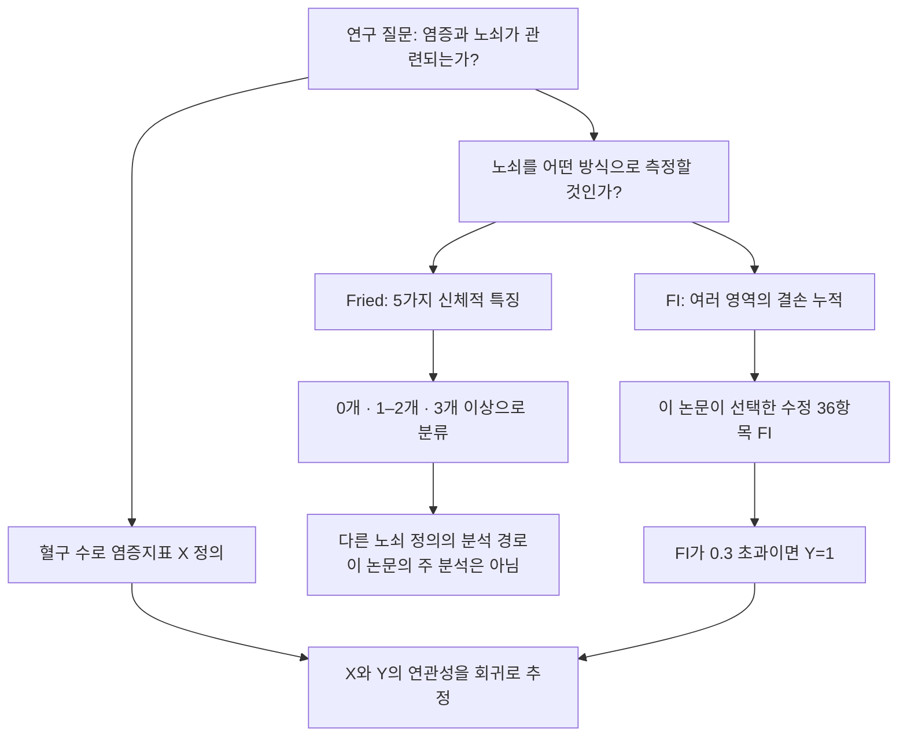
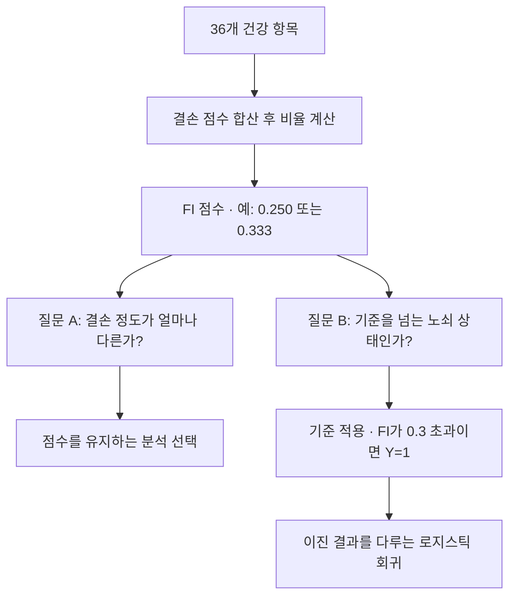

---
tags:
  - 염증과노쇠
  - 통계기초
순서: 6
---

# 03 FI와 노쇠 여부를 구별하기

[[00-start 처음부터 따라가는 분석 흐름|전체 흐름]] · [[03-paper 03 이 논문은 FI를 어떻게 정의했나|논문에 적용하기]]

> 들어오는 자료: 노쇠라는 연구 개념과 개인별 건강 측정값 → 나오는 결과: 선택한 측정법에 따른 점수와 결과변수 Y. 먼저 노쇠를 어떻게 측정할지 결정해야 합니다.

## 염증지표 X의 다음에는 무엇을 정의해야 하나?

앞 단계에서는 혈구 수로 NLR·MLR·SIRI·SII라는 **설명변수 X**를 만들었습니다. 이제 ‘노쇠와 관련이 있는가’라는 질문의 나머지 절반, **노쇠라는 결과변수 Y**를 정의해야 합니다. 노쇠는 혈액검사 한 칸에서 그대로 읽히는 값이 아니므로 측정법을 선택해야 합니다. 이 선택 단계에서 Fried 기준과 FI를 비교합니다.

여기서 먼저 하는 일은 **개념을 측정 가능한 변수로 정의하는 것**입니다. 그 뒤 회귀에서 하는 일은 **이미 정의한 변수 사이의 연관성을 추정하는 것**입니다. X와 Y라는 역할을 부여했다고 원인 방향이 증명되는 것은 아닙니다.

## 같은 노쇠를 측정하는 두 접근

| 선택할 접근 | 어떤 노쇠를 수치화하나 | 사용하는 정보 | 만들어지는 값 |
|---|---|---|---|
| Fried phenotype | 신체 기능·에너지·활동 저하라는 표현형 | 체중 변화, 탈진감, 악력, 보행, 활동 | 5가지 중 해당 개수와 분류 |
| Rockwood의 FI | 여러 영역에 축적된 건강 결손 | 질환, 기능 제한, 건강 상태, 검사 이상 등 | 평가한 항목 대비 결손 점수 비율 |

어느 방법을 선택하느냐에 따라 같은 사람의 노쇠 분류가 달라질 수 있습니다. Fried 기준은 FI를 계산하기 전에 통과해야 하는 검사도, FI 안에 반드시 들어가는 다섯 하위항목도 아닙니다. **대안적인 노쇠 측정법**입니다.

## Fried 기준을 선택하면 Y는 어떻게 만들어지나?

| 기준 | 측정·평가의 개요 |
|---|---|
| 비의도적 체중 감소 | 원형의 기준시점 평가에서는 지난 1년간 10파운드, 약 4.5kg 초과 감소 |
| 자기보고 탈진감 | CES-D의 관련 질문으로 기력·탈진 상태 평가 |
| 악력 저하 | 악력을 측정하고 성별·BMI에 따른 기준 적용 |
| 느린 보행 | 보행 시간을 측정하고 성별·키에 따른 기준 적용 |
| 낮은 신체활동 | 활동 설문으로 추정한 에너지 소비량과 성별 기준 적용 |

각 항목을 0 또는 1로 세어 **0개는 비노쇠, 1–2개는 전노쇠, 3–5개는 노쇠**로 분류합니다. 예를 들어 탈진감·악력 저하·느린 보행에 해당하면 3개로 노쇠입니다. 세 범주를 분석할지, 노쇠 여부로 다시 이분화할지는 이후 연구 질문에 맞춰 정합니다. 원래의 측정 규칙과 수정판을 구별해야 합니다. [Fried 원 연구](https://pubmed.ncbi.nlm.nih.gov/11253156/), [원 연구 Table 1](https://dms.ufpel.edu.br/static/bib/fried_frailty.pdf).

이번 논문은 이 경로 대신 **FI로 결손 누적을 측정하는 경로**를 선택했습니다. 따라서 다음부터는 그 경로를 따라 FI 점수와 Y를 만듭니다.

## FI는 무엇인가?

FI는 **Frailty Index, 노쇠지수**입니다. 마지막 글자는 소문자 l이 아니라 대문자 I입니다. 결손 누적 접근에서는 다양한 건강 문제를 평가해, 평가한 항목 가운데 결손이 차지하는 비율을 계산합니다.

`FI = 건강 결손 점수의 합 / 평가에 포함한 항목 수`

모든 36개 항목을 0 또는 1로 평가했다면, 결손이 9개인 사람은 FI=9/36=0.25입니다. 질환, 기능 저하, 검사 이상처럼 서로 다른 영역의 문제를 모아 전반적 취약성을 표현합니다. **아무 항목이나 많이 더하면 좋은 지표가 되는 것은 아닙니다.** 건강·나이와의 관련성, 여러 영역의 포함, 과도한 중복, 결측과 측정 일관성 등을 검토해야 합니다. [FI 구성 방법: Searle 등](https://pmc.ncbi.nlm.nih.gov/articles/PMC2573877/), [FI 구성의 10단계](https://pmc.ncbi.nlm.nih.gov/articles/PMC10733590/).

같은 FI라도 결손 조합은 다를 수 있습니다. 9개가 전부 같을 필요는 없습니다. FI는 개별 진단을 대체하기보다 **결손 누적이라는 구성개념**을 수치화합니다. 노쇠를 나타내는 유일한 방식도 아니며, 신체적 특징 중심의 Fried phenotype 등 다른 정의가 있습니다.

## 측정법 선택이 분석까지 이어지는 경로

## ‘점수 만들기’ 다음에 ‘분류하기’가 있다

**로지스틱 회귀가 FI를 분해하는 것이 아닙니다.** 연구자가 먼저 FI를 분류한 다음 그 이진 결과에 맞는 모형을 선택합니다.

## 0.3으로 나눠도 되는가?

연구 질문이 ‘정의된 노쇠 상태와의 관련성’이고 기준에 근거가 있다면 가능한 선택입니다. 하지만 기준은 보편적인 자연 경계가 아니며 질문이 달라집니다. 이분화하면 FI=0.31과 0.60이 모두 1이 되고, 0.29와 0.31은 다른 집단이 됩니다. 정도의 정보가 사라지고 경계 근처에서는 측정오차에 민감합니다. [연속변수 이분화의 정보 손실](https://pmc.ncbi.nlm.nih.gov/articles/PMC1458573/).

따라서 적절성을 평가하려면 기준의 근거, 다른 기준에서의 안정성, 점수를 유지한 분석과의 일치 여부를 확인해야 합니다. 로지스틱을 썼다는 사실만으로 0.3의 정당성이 입증되지는 않습니다.

HTML의 조절 예시와 같은 정적 계산: 결손 11개이면 FI=11/36=0.306입니다. 기준이 0.30이면 Y=1, 0.35이면 Y=0입니다. 사람의 건강 상태는 그대로이고 분석용 정의만 바뀝니다.

확인 질문: FI=0.25이면 노쇠 확률이 25%라는 뜻인가?

아닙니다. 평가한 건강 결손의 비율이 25%라는 뜻입니다. FI 점수, 집단의 노쇠 비율, 회귀가 예측한 개인의 노쇠 확률은 서로 다른 값입니다.

<!-- V3-CONCEPT -->

## 결측과 설문에서 건너뛴 응답은 같은가?

예를 들어 “건강 문제로 활동이 제한되나요?”에 아니오라고 답한 사람에게 뒤의 세부 문항을 묻지 않았다면, 빈칸에는 설문 설계에 따른 이유가 있습니다. 반대로 답변 거부나 검사 누락은 그 사람이 건강하다는 뜻이 아닙니다. 따라서 **빈칸을 모두 0으로 채우는 것**과 **공식 분기 조건을 확인한 일부 빈칸을 재구성하는 것**은 다릅니다.

36항목 완비 규칙은 36개 모두 알려진 사람만 남깁니다. 최소 30항목 규칙은 30개 이상 알려지면 `관측된 결핍 합/관측된 항목 수`를 계산합니다. 가상으로 관측 30개 중 9개가 결핍이면 FI=0.30입니다. 빠진 6개까지 실제로 알았을 때의 FI와 같다는 보장은 없습니다. 분모를 바꾸는 것은 단순 계산 편의가 아니라 누락된 건강 정보를 다루는 가정을 바꿉니다.

새 규칙에서 분석 결과가 달라지면 두 가지를 나눠 봅니다. 같은 사람의 점수가 바뀌었는지, 새 사람이 들어와 집단 구성이 달라졌는지입니다. 두 효과를 구분하려면 먼저 공통 참여자끼리 비교하고, 그다음 확장된 집단의 결과를 봅니다. 실제 확인 결과는 같은 단계의 paper 문서에 있습니다.

---

[[02-paper 02 논문에서 네 지표를 만든 방법|이전: 02 논문에서 네 지표를 만든 방법]] · [[03-paper 03 이 논문은 FI를 어떻게 정의했나|다음: 03 이 논문은 FI를 어떻게 정의했나]]
