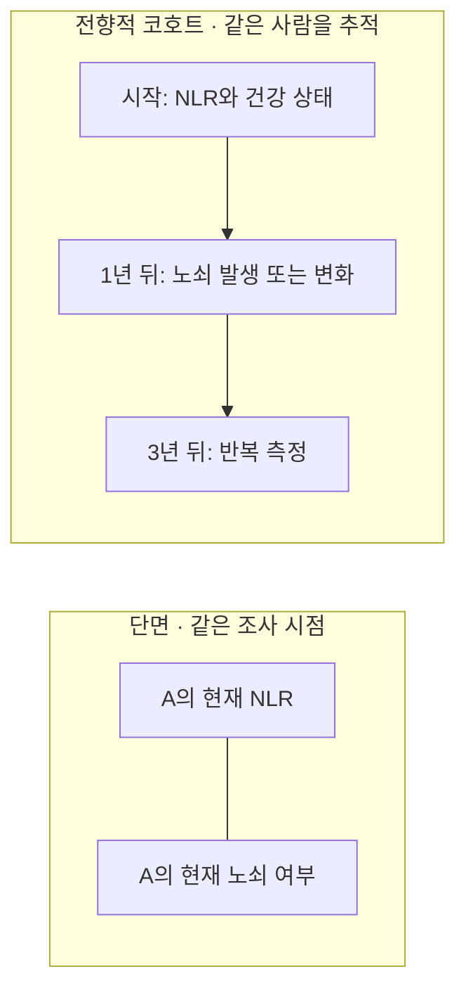

---
tags:
  - 염증과노쇠
  - 통계기초
순서: 8
---

# 04 누구를 언제 관찰했는가

[[00-start 처음부터 따라가는 분석 흐름|전체 흐름]] · [[04-paper 04 표본 선정과 단면자료의 한계|논문에 적용하기]]

> 들어오는 자료: X·Y·C가 있는 사람들의 행 → 나오는 결과: 목표 모집단, 분석 표본, 시간 구조, 결측 처리에 대한 정의.

## 세 질문을 따로 묻는다

1. **누구에게 답하려는가?** 목표 모집단의 문제입니다.
2. **누가 실제 자료에 들어왔는가?** 표집·참여·제외의 문제입니다.
3. **같은 사람을 언제 몇 번 측정했는가?** 단면·종단 설계의 문제입니다.

많은 사람을 관찰하는 것과 한 사람을 여러 번 관찰하는 것은 다릅니다. 10만 명을 한 번 관찰해도 ‘염증이 먼저였는지’라는 시간 정보는 자동으로 생기지 않습니다.

## 단면과 종단을 작은 예로

단면자료는 현재 함께 나타나는 상태를 비교하기 좋지만, 원인과 결과의 선후를 구별하기 어렵습니다. 노쇠가 활동 감소·질환 악화·염증 증가로 이어지는 역방향도 가능하고, 다른 질환이 둘을 함께 높일 수도 있습니다.

## ‘표적 관찰 데이터’와 무엇이 다른가?

이 표현은 하나로 정해진 통계 용어가 아니므로, 여기서는 **특정 연구 질문을 위해 대상을 모집하고 필요한 변수를 반복 측정하는 전향적 관찰자료**로 해석합니다. 만약 병원 기록이나 임상시험을 뜻했다면 아래 다른 열을 보세요.

| 설계 | 장점 | 여전히 남는 한계 |
|---|---|---|
| NHANES 같은 인구조사 | 폭넓은 인구 특성, 적절한 가중치로 모집단 추정 | 원하는 모든 측정이 없고 단면 관계일 수 있음 |
| 목적에 맞춘 전향적 관찰연구 | 시점·반복 측정·변수 선택을 연구 질문에 맞출 수 있음 | 무작위 배정이 아니므로 교란, 탈락, 선택 편향 가능 |
| 특정 병원·질환의 진료자료 | 질환과 치료 정보가 상세할 수 있음 | 의료기관 방문자의 특성, 검사 이유에 따른 편향 |
| 무작위 중재시험 | 개입 배정으로 교란을 줄이고 효과를 비교 | 관찰연구와 다른 설계; 참여자 제한·윤리·비용·탈락 문제 |

## 대표성은 표본 수만으로 얻지 못한다

무작위성이 없는 편향된 표본은 커져도 편향이 남을 수 있습니다. NHANES는 복합확률표집과 조사 가중치를 사용합니다. 가중치는 각 참여자가 모집단에서 얼마나 많은 사람을 대표하는지를 반영하며, 층화·군집은 표준오차 계산에도 중요합니다. 표집 설계와 이후 결측에 따른 제외를 모두 고려해야 합니다. [CDC 표본설계](https://wwwn.cdc.gov/nchs/nhanes/tutorials/SampleDesign.aspx), [가중치](https://wwwn.cdc.gov/nchs/nhanes/tutorials/weighting.aspx), [분산 추정](https://wwwn.cdc.gov/nchs/nhanes/tutorials/varianceestimation.aspx).

## 공변량 정보 부족은 무엇인가?

어떤 사람의 NLR와 노쇠 여부는 있는데 ‘흡연 여부’가 빈칸일 수 있습니다. 그 사람은 존재하지만 **보정에 필요한 특정 열의 값이 없는 것**입니다. 결측은 아니오·0과 다릅니다. 소득을 말하지 않은 사람을 소득 0으로 바꾸면 잘못된 자료가 됩니다.

행을 제외하거나, 결측 이유에 관한 가정 아래 다중대치 등을 사용할 수 있습니다. 어느 방법이든 결측 과정에 대한 검토가 필요하며, 자동으로 편향이 사라지는 것은 아닙니다.

---

[[03-paper 03 이 논문은 FI를 어떻게 정의했나|이전: 03 이 논문은 FI를 어떻게 정의했나]] · [[04-paper 04 표본 선정과 단면자료의 한계|다음: 04 표본 선정과 단면자료의 한계]]
