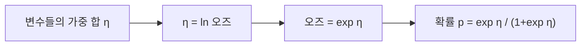

---
tags:
  - 염증과노쇠
  - 통계기초
순서: 12
---

# 06 확률에서 오즈와 로지스틱으로

[[00-start 처음부터 따라가는 분석 흐름|전체 흐름]] · [[06-paper 06 이 논문의 OR를 정확히 읽기|논문에 적용하기]]

> 들어오는 자료: 사람별 Y=0/1과 설명변수 → 나오는 결과: 조건에 따른 노쇠 확률과 오즈비를 표현하는 모형.

## 확률과 오즈의 분모가 다르다

가상 집단 100명 중 노쇠가 20명이라면 확률(비율)은 20/100=0.20입니다. 오즈는 **노쇠인 사람 대 비노쇠인 사람의 비**이므로 20/80=0.25입니다.

`오즈 = p/(1−p)`

`확률 = 오즈/(1+오즈)`

| 노쇠 확률 p | 오즈 | 읽는 말 |
|---:|---:|---|
| 0.20 | 0.25 | 노쇠 1 대 비노쇠 4 |
| 0.50 | 1.00 | 1 대 1 |
| 0.80 | 4.00 | 4 대 1 |

오즈는 확률의 다른 표현입니다. 확률보다 본질적으로 더 임상적인 숫자여서 사용하는 것은 아닙니다.

## 로지스틱에서 왜 자연스럽게 오즈를 쓰나?

연령·NLR 등 여러 변수를 더해 점수 `η=β0+β1X+γC`를 만들면 그 점수는 어떤 실수도 될 수 있습니다. 그런데 확률은 0과 1 사이여야 합니다. 로지스틱은 다음 연결을 사용합니다.

따라서 `ln[p/(1−p)] = β0+β1X+γC`입니다. 오른쪽은 변수를 더하는 구조이고 왼쪽은 **확률 자체가 아니라 로그오즈**입니다. X가 1 증가하면 로그오즈가 β1 증가하고, 오즈는 exp(β1)배가 됩니다. 그 배수가 OR입니다. [Penn State 로지스틱 회귀](https://online.stat.psu.edu/stat462/node/207/).

계수 β는 연구자가 임의로 정하지 않습니다. 모형이 실제 관측된 0/1 자료를 잘 설명하도록 우도(관측 결과가 나타날 가능성을 묶은 함수)를 최대화하는 방식으로 추정합니다. 복합표본 분석에서는 조사 가중치와 설계에 맞는 추정·표준오차 처리가 필요합니다.

## OR=2이면 확률도 2배인가?

기준 집단 확률 20%의 오즈는 0.25입니다. OR=2이면 비교 집단 오즈는 0.50, 확률은 0.50/1.50=33.3%입니다. 확률의 비는 33.3/20=1.67입니다. **OR 2와 확률의 비 1.67은 다릅니다.**

`비교 집단 확률 = OR×p0 / (1−p0+OR×p0)`

정적 예시: OR=2일 때 기준 확률이 1%이면 비교 확률 약 1.98%, 기준 확률 20%이면 33.3%, 기준 확률 50%이면 66.7%입니다. 같은 OR라도 절대 확률 차이가 다릅니다. 실제 조정 OR를 확률로 바꾸려면 같은 조건의 기준 확률이 필요합니다.

## 오즈만이 가능한 선택은 아니다

이진 자료에도 질문에 따라 유병비(PR), 유병률 차이 등을 직접 추정하는 모형을 사용할 수 있습니다. 예를 들어 적절한 설계 보정을 한 log-binomial 또는 robust Poisson 접근을 검토할 수 있습니다. 이는 이 논문이 사용한 방법이 아니라 가능한 다른 분석입니다.

다음 페이지에서 이 원리를 실제 Table 2의 로그변환 지표에 적용합니다.

---

[[05-paper 05 Table 1을 읽는 순서|이전: 05 Table 1을 읽는 순서]] · [[06-paper 06 이 논문의 OR를 정확히 읽기|다음: 06 이 논문의 OR를 정확히 읽기]]
