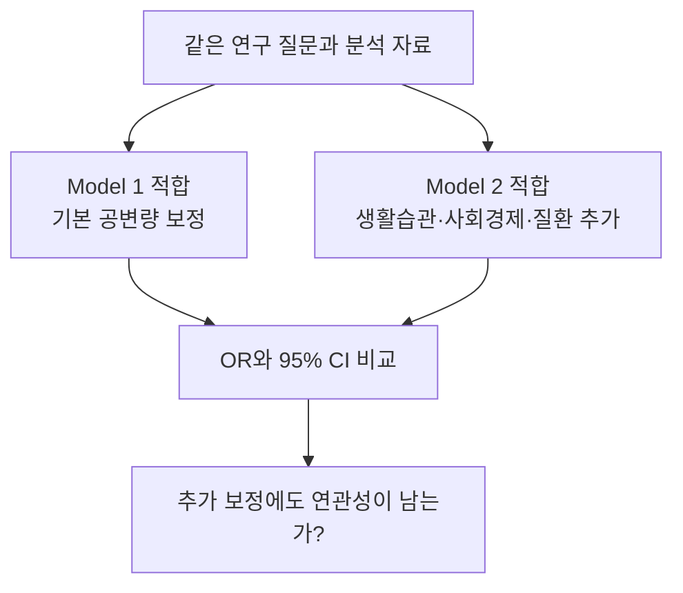
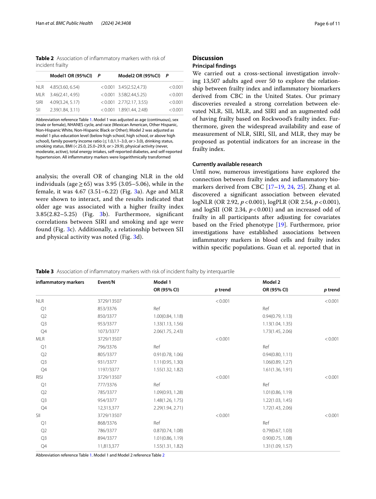

---
tags:
  - 염증과노쇠
  - 논문적용
순서: 17
---

# 08 Table 2의 Model 1과 Model 2

<!-- V2-LEARNING-STAGE-08 -->

> 읽는 순서: **논문 설명 → 남긴 의문 → 구현 → 재현 비교 → 추가 검토 → 갱신된 해석**. 개념이 막히면 위 통계 개념 노트로 돌아가세요.

## 1. 처음의 논문 설명과 데이터 흐름

> 아래는 구현 전에 작성한 원문 해설입니다. 당시의 미실행 설명은 이 구역의 작성 시점을 뜻하며, 이후 실제 실행 상태는 3–6구역에서 확인합니다.

[[00-start 처음부터 따라가는 분석 흐름|전체 흐름]] · [[08-concept 08 공변량 보정과 두 모형의 목적|통계 개념 배우기]]

> 논문 적용: 단계적으로 보정범위를 넓혀도 관심 지표와 노쇠의 연관성이 남는지 확인합니다.

### 모형에 무엇이 들어가나?

| 요소 | Model 1 | Model 2 |
|---|---|---|
| Y | FI>0.3 여부 | 동일 |
| 관심 X | 로그변환한 염증지표 | 동일 |
| 기본 공변량 | 연령, 성별, 인종, 조사 주기 | 모두 유지 |
| 추가 공변량 | 없음 | 교육, 소득비, BMI, 신체활동, 에너지 섭취, 흡연, 음주, 당뇨, 고혈압 |

### 실제 숫자를 읽는다

| 로그 지표 | Model 1 OR (95% CI) | Model 2 OR (95% CI) |
|---|---|---|
| NLR | 4.85 (3.60–6.54) | 3.45 (2.52–4.73) |
| MLR | 3.46 (2.41–4.95) | 3.58 (2.44–5.25) |
| SIRI | 4.09 (3.24–5.17) | 2.77 (2.17–3.55) |
| SII | 2.39 (1.84–3.11) | 1.89 (1.44–2.48) |

모두 보고된 p<0.001입니다. NLR·SIRI·SII는 OR가 작아졌지만 MLR는 조금 커졌습니다. 보정이란 OR를 항상 줄이는 과정이 아닙니다. 해석은 **‘선택한 공변량을 고려한 뒤에도 양의 연관성이 관찰되었다’**까지입니다.

### 이 표가 답하지 않는 것

- 네 지표 중 어떤 것이 미래 노쇠를 가장 잘 예측하는지는 AUC·교정·외부 검증 등을 확인해야 합니다. OR가 큰 순서로 예측력 순위를 매기지 않습니다.
- Model 2가 모든 교란을 제거했다는 뜻은 아닙니다.
- 당뇨·고혈압은 FI 구성에도 관련됩니다. 결과 구성 항목을 보정한 해석에는 주의가 필요합니다.
- 지표 네 개가 서로 독립적인 원인이라는 뜻이 아닙니다.

근거: [원문 Table 2와 각주, PDF 6쪽](assets/paper.pdf#page=6).

현재 결과는 log(X) 한 단위 증가에 대한 요약입니다. 다음은 같은 데이터를 ‘높은 지표군 대 낮은 지표군’으로 다시 표현해 비교합니다.

## 2. 이 단계에서 남겨 둔 의문

**같은 보정 모형을 구현했을 때 원문 OR와 비교할 수 있는가?**

Model1의 공변량 구조를 구현했어도 FI 코딩·표본·로그 밑·조사설계 처리의 차이가 남는다.

> 문제 `ISSUE-08` · 종류: 미공개 구현·추정 비교 · 연결 작업: `V2-I01`. 기록 ID를 몰라도 아래 설명을 읽을 수 있습니다.

## 3. 어떻게 구현했고 무엇을 얻었나

<!-- V3-STAGE-08 -->

### 후속 실행: 남은 논문 분석까지 구현

**Model2까지 구현한 결과** — 두 모형을 동일한 10874명에 적합해 대상자 변화와 보정 추가를 구별했습니다.

| 지표 | Model1 같은 사람 OR (CI) | Model2 같은 사람 OR (CI) | Model2 2배 증가 OR |
|---|---|---|---|
| NLR | 2.04 (1.69–2.45) | 1.66 (1.34–2.06) | 1.42 |
| MLR | 1.88 (1.43–2.47) | 1.85 (1.37–2.48) | 1.53 |
| SIRI | 1.97 (1.69–2.3) | 1.5 (1.26–1.79) | 1.33 |
| SII | 1.43 (1.2–1.71) | 1.21 (0.991–1.47) | 1.14 |

위 OR 구간은 자연로그 1 증가에 대한 점별 구간입니다. 큰 Model1 집단의 결과도 CSV에 따로 남겼습니다. 교육·PIR·BMI·흡연·음주·여가활동·열량·당뇨·고혈압을 추가했습니다. 음주는 “어느 한 해 12잔 이상”, 활동은 여가 강도, 열량은 신뢰할 수 있는 day1이라는 공개 문항 기반 후보입니다. 이를 저자의 과거1년 음주·정확한 활동량·전 기간 2일 식이 정의와 같다고 부르지 않습니다.

위 주 Model2는 검진(MEC) 가중치를 쓴 탐색적 열량 보정 후보입니다. 식이 응답자의 모집단 대표성을 식이 전용 가중치와 동일하게 보장한다고 해석하지 않습니다.

**식이 민감도:** 2003–2016년의 양수 WTDR2D/7 전체 연령 설계에서 두 날 모두 신뢰 가능한 성인 하위집단을 사용했습니다. 동일한 사람과 가중치에서 열량 변수만 바꿨습니다.

| 지표 | 같은 사람·가중치: day1 OR | 같은 사람·가중치: 2일 평균 OR |
|---|---|---|
| NLR | 1.37 (1.07–1.77) | 1.37 (1.07–1.77) |
| MLR | 1.47 (1.05–2.06) | 1.48 (1.05–2.07) |
| SIRI | 1.25 (1–1.56) | 1.25 (1.01–1.56) |
| SII | 1.07 (0.819–1.39) | 1.07 (0.819–1.39) |

검진 가중치의 전체 기간 분석과 식이 가중치의 2일 응답자 분석은 적용 집단이 다릅니다. day1과 mean2의 위 비교 자체는 같은 식이 하위집단의 비교입니다. [같은 표본 비교 전체 결과](assets/V3-20260928T003525Z/continuous_models.csv)

> 아래의 기존 V2 실행 내용은 당시 완비 후보의 기록입니다. 이번 후보와 표본·정의가 같다고 섞어 읽지 않습니다.

**새 구현:** Model1의 보정 구조는 연령·성별·인종·조사주기입니다. 후보 FI의 정의와 분석집단 차이를 유지한 채 로그 단위를 명시했습니다.

| 지표 | ln 1단위 OR | log10 1단위 OR |
|---|---|---|
| NLR | 2.036 | 5.139 |
| MLR | 1.837 | 4.054 |
| SIRI | 1.961 | 4.713 |
| SII | 1.475 | 2.446 |

이전 자연로그 OR와 원문 OR를 같은 숫자 단위라고 가정해 차이를 해석해서는 안 됩니다. 원문은 밑을 명시하지 않았고 Table1은 원척도 값이므로 이 비교로 저자의 밑을 결정할 수 없습니다. Model2는 미확인 공변량 정의를 채운 척하지 않고 미해결로 둡니다.

## 4. 논문과 비교하면 어디까지 일치하는가

원문 Table2와 후보 Model1은 X·Y의 개념과 일부 보정 구조를 공유하지만, FI·표본·변환 밑·가중 처리의 동등성이 확인되지 않았습니다. 따라서 정확 일치/불일치 검정보다 비교 가능 조건이 미충족이라는 판정이 우선입니다.

## 5. 의문을 검토한 과정과 추가 분석

### 실행·검토: 보정 모형과 결과변수 변경을 분리하기

**실행한 논문 연결 모형:** 각 지표를 하나씩 자연로그 변환하고 연령·성별·인종·조사주기를 보정했습니다. 후보 FI>0.3의 Model1 구조입니다. 조사 설계를 적용한 결과는 다음과 같습니다. 전부 동일한 9,786명을 사용하며, CI는 점별 구간입니다.

| 지표 | OR / 자연로그 1단위 | 95% CI |
|---|---|---|
| NLR | 2.036 | 1.740–2.381 |
| MLR | 1.837 | 1.490–2.264 |
| SIRI | 1.961 | 1.727–2.226 |
| SII | 1.475 | 1.252–1.737 |

비가중 Model1도 함께 저장했습니다. 이것은 두 분석집단을 혼합한 비교가 아닙니다. Model2의 신체활동·식이 등 정의와 결측 조건을 저자와 동일하게 확인하지 못해, 이를 임의 조합한 모형을 Model2 재현이라고 부르지 않았습니다. Model1과 Model2의 차이는 통계기법의 우열이 아니라 보정하는 정보의 차이입니다.

**연속 FI 대안:** 설계 기반 `svyglm(..., family=quasibinomial())`으로 E(FI|X)의 logit을 추정했습니다. 0·1도 평균 모형의 입력이 될 수 있으며, 일반 `quasibinomial` 이름만으로 robust 표준오차가 생기는 것은 아닙니다. 여기서는 survey 설계로 표준오차를 계산했습니다. beta regression은 (0,1) 연속 분포 가정과 경계값 처리를 추가로 요구합니다. 이 후보 FI는 1/36 간격의 이산 점수이므로 이번 대안은 평균 구조를 직접 다루는 fractional logit으로 고정했습니다. beta regression이 항상 불가능하다는 뜻은 아닙니다.

| 지표 | 낮은 지표값에서 조정 평균 FI | 높은 지표값에서 조정 평균 FI | 차이 |
|---|---|---|---|
| NLR | 0.1619 | 0.1859 | 0.0239 |
| MLR | 0.1662 | 0.1823 | 0.0162 |
| SIRI | 0.1583 | 0.1884 | 0.0302 |
| SII | 0.1663 | 0.1827 | 0.0164 |

여기서 낮음/높음은 해당 로그 지표의 비가중 25·75백분위입니다. 다른 공변량은 관측 분포에 두고 가중 평균 예측했습니다. 위 값은 예측 점추정치이며 CI를 계산하지 않았습니다. 인과적 개입 효과도 아닙니다. **fractional 모형의 exp(β)를 ‘노쇠 여부 OR’로 해석하면 안 됩니다.**

[32개 모형 계수·SE·CI·수렴·탐색적 BH 결과](assets/analysis-20260928/runs/A02-models/model_sensitivities.csv) · [fractional 예측 정의와 값](assets/analysis-20260928/runs/A02-models/fractional_mean_predictions.csv) · [독립 코드 검토](assets/analysis-20260928/runs/S01-paper-contract/extensions_review.md)

## 6. 갱신된 해석과 남은 한계

**후속 실행 상태:** 공개자료로 정의한 해당 후보 분석과 독립 검토를 완료했습니다. 저자 설정 확인·정확 재현 여부와 후보 구현 완료는 별도 판정입니다. 이전 판정은 아래에 이력으로 보존합니다.

**이전 V2 판정: 부분 해결 — 계산·진단은 수행했으나 저자 미공개 정의는 남음**

로그 척도와 모형이 같아도 분석집단이 다르면 정확 재현 통과로 판정하지 않는다. Model2의 미공개 정의는 남긴다.

새 계산은 독립 계획 검토 후 실행하고 별도 결과 검토를 거쳤습니다. 과거 자료·모형의 재사용 감사는 입력과 코드의 일관성을 확인한 것이며, 저자 FI 정의나 인과적 해석의 인증이 아닙니다.

다음: [[09-concept 09 사분위군은 보정이 아니라 비교 방식|설명변수 사분위와 Table3의 개념]] → [[09-paper 09 Table 3은 같은 데이터를 어떻게 다시 보나|논문 적용]].

