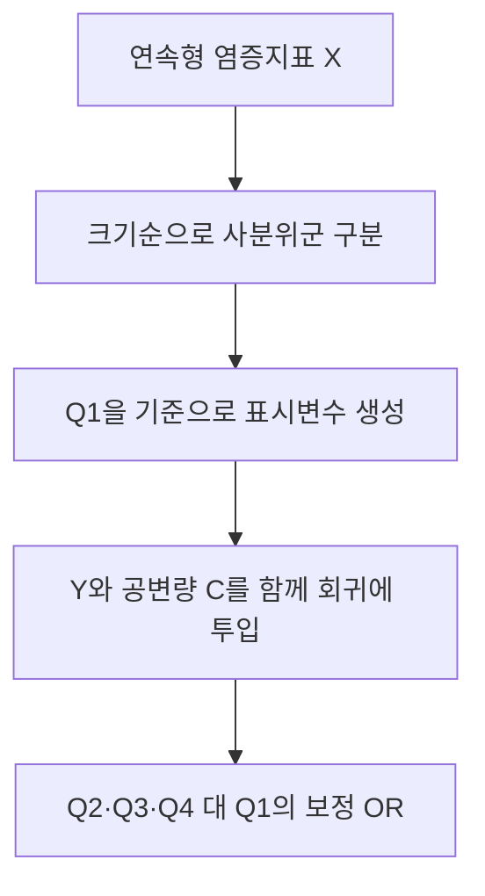

---
tags:
  - 염증과노쇠
  - 통계기초
순서: 18
---

# 09 사분위군은 보정이 아니라 비교 방식

[[00-start 처음부터 따라가는 분석 흐름|전체 흐름]] · [[09-paper 09 Table 3은 같은 데이터를 어떻게 다시 보나|논문에 적용하기]]

> 들어오는 자료: 연속형 X → 나오는 결과: 낮은 값부터 약 25%씩 묶은 Q1–Q4 범주. 그 뒤 별도로 공변량을 보정합니다.

## 사분위수와 사분위군을 구별한다

평면을 네 조각으로 나누는 ‘사분면’이 아닙니다. **하나의 숫자열을 크기순으로 줄 세워 네 집단으로 나누는 것**입니다. P25·P50·P75는 세 경계인 사분위수, Q1·Q2·Q3·Q4는 경계로 나뉜 네 집단인 사분위군입니다. 문헌에서 Q1을 제1사분위수라는 뜻으로도 쓰므로 문맥을 봅니다.

가상 NLR 값과 앞에서 계산한 경계 1.3, 1.8, 2.8을 사용하면 다음과 같습니다.

| 사분위군 | 포함되는 예시 사람 | NLR | 경계 규칙 |
|---|---|---|---|
| Q1 | A, B | 1.0, 1.2 | X≤1.3 |
| Q2 | C, D | 1.4, 1.6 | 1.3<X≤1.8 |
| Q3 | E, F | 2.0, 2.4 | 1.8<X≤2.8 |
| Q4 | G, H | 3.2, 7.2 | X>2.8 |

값의 폭이 같은 구간이 아니라 **사람 수가 비슷한 구간**입니다. 동일한 값이 경계에 많이 몰리거나 가중 분위수를 쓰면 실제 각 집단의 표본 수는 정확히 같지 않을 수 있습니다.

## 회귀에서 무엇이 바뀌나?

연속형 모형은 `β×log(X)`를 넣습니다. 사분위 범주 모형은 Q1을 기준으로 `Q2인가`, `Q3인가`, `Q4인가` 세 표시변수를 넣습니다. 따라서 Q2/Q1, Q3/Q1, Q4/Q1의 OR가 나옵니다. 처음부터 네 군의 효과가 일직선으로 증가한다고 강제하지 않습니다.

## 어떤 효과가 있고, 무엇을 하지 못하나?

장점은 ‘상위 25% 대 하위 25%’처럼 비교가 쉽고 연속형 한 기울기에만 의존하지 않는다는 점입니다. Q4의 3.2와 7.2가 같은 범주가 되어 그 범주 안에서 값의 크기 차이는 모형에 반영되지 않습니다.

대신 정보와 정밀도를 잃고 경계값에 의존합니다. 임상적 정상·비정상 기준도 아니며 표본이 달라지면 경계가 달라집니다. 극단값을 해결하거나 나이·흡연 효과를 제거한 것이 아닙니다. **범주화는 X의 표현 변경, 보정은 C를 함께 고려하는 작업**입니다.

## 추세 p값은 별도 질문

Q1에서 Q4로 갈수록 전반적인 순서 경향이 있는지 검정할 수 있습니다. 군 번호나 군별 중앙값 등을 점수로 넣는 방법이 있으므로 정확한 구현을 확인해야 합니다. 유의한 추세가 모든 인접 집단의 차이까지 유의하다거나, 연속 관계가 직선이라는 증거는 아닙니다.

주의: 8명 예시의 Q1에는 노쇠가 0명입니다. 이 작은 예시로 안정적인 사분위 로지스틱 OR를 추정한다고 주장하면 안 됩니다. 표는 **구간 나누기 원리**를 보여주며, 실제 OR는 논문의 큰 표본에서 읽습니다.

---

[[08-paper 08 Table 2의 Model 1과 Model 2|이전: 08 Table 2의 Model 1과 Model 2]] · [[09-paper 09 Table 3은 같은 데이터를 어떻게 다시 보나|다음: 09 Table 3은 같은 데이터를 어떻게 다시 보나]]
