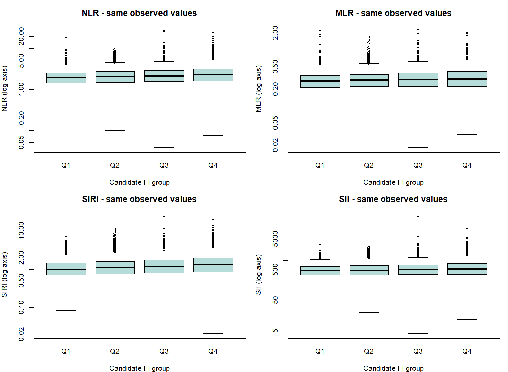

---
tags:
  - 염증과노쇠
  - 논문적용
순서: 19
---

# 09 Table 3은 같은 데이터를 어떻게 다시 보나

<!-- V2-LEARNING-STAGE-09 -->

> 읽는 순서: **논문 설명 → 남긴 의문 → 구현 → 재현 비교 → 추가 검토 → 갱신된 해석**. 개념이 막히면 위 통계 개념 노트로 돌아가세요.

## 1. 처음의 논문 설명과 데이터 흐름

> 아래는 구현 전에 작성한 원문 해설입니다. 당시의 미실행 설명은 이 구역의 작성 시점을 뜻하며, 이후 실제 실행 상태는 3–6구역에서 확인합니다.

[[00-start 처음부터 따라가는 분석 흐름|전체 흐름]] · [[09-concept 09 사분위군은 보정이 아니라 비교 방식|통계 개념 배우기]]

> 논문 적용: 네 지표를 각각 사분위군으로 나눠 Q1을 기준으로 비교합니다. Table 2의 OR를 쪼개서 만든 표가 아닙니다.

### NLR의 실제 경계

논문은 NLR 경계를 1.53, 2.08, 2.83으로 보고합니다. 낮은 값부터 Q1, Q2, Q3, Q4로 해석하면 다음과 같습니다.

| NLR군 | 범위 | Model 2의 OR (95% CI) |
|---|---|---|
| Q1 | ≤1.53 | 1, 기준군 |
| Q2 | >1.53, ≤2.08 | 0.94 (0.79–1.13) |
| Q3 | >2.08, ≤2.83 | 1.13 (1.04–1.35), 원문 표기 |
| Q4 | >2.83 | 1.73 (1.45–2.06) |

Q4의 해석은 **다른 보정변수가 같은 조건에서 NLR 상위 사분위군의 현재 노쇠 오즈가 하위 사분위군보다 73% 높았다**입니다. 확률 73% 증가나 FI 점수 73% 증가와 구별합니다.

### 다른 지표의 Q4 대 Q1

| 지표 | Model 2 OR | 95% CI |
|---|---:|---|
| NLR | 1.73 | 1.45–2.06 |
| MLR | 1.61 | 1.36–1.91 |
| SIRI | 1.72 | 1.43–2.06 |
| SII | 1.31 | 1.09–1.57 |

표는 모두 추세 p<0.001을 제시합니다. 하지만 예를 들어 SII의 중간 사분위 OR는 1보다 작습니다. 따라서 ‘모든 단계에서 일관되게 같은 폭으로 상승’이라고 해석하지 않습니다. 이것이 다음에 연속 곡선을 볼 이유입니다.

### 범주화와 로그변환의 관계

양수에서 로그변환은 순서를 유지합니다. 같은 사람·같은 분위수 정의라면 로그 전후의 사분위 소속은 같습니다. 하지만 로그변환한 수치를 연속형으로 회귀에 넣는 것과 사분위 범주를 넣는 것은 **서로 다른 모형**입니다.

### 재현 시 원문 표기의 문제

SIRI Q3의 하한이 본문에 0.76으로 적혀 Q2와 겹칩니다. 다른 위치에 RISI라는 표기도 있습니다. 순서상 오기 가능성이 있지만 분석 코드를 재현할 때 임의로 고쳤다고 숨기면 안 됩니다. 사분위 산정에서 가중치를 썼는지, 동점과 경계값을 어떻게 처리했는지, 추세 검정에 어떤 점수를 썼는지도 충분히 보고되지 않았습니다.

이 학습 자료는 원문의 보고 결과를 설명합니다. 원자료와 코드를 확보해 결과를 재현·검증한 것은 아닙니다.

근거: [원문 PDF 3쪽의 경계와 Table 3, 6쪽](assets/paper.pdf#page=6).

이제 ‘높은 군에서 더 높은가’는 확인했습니다. 그러나 네 범주 사이의 정확한 굴곡과 하위집단 차이, 보정 선택의 영향을 다음 단계에서 확인해야 합니다.

## 2. 이 단계에서 남겨 둔 의문

**논문과 과제의 사분위 분석은 같은 질문인가?**

논문은 염증지표군→노쇠 여부 OR, 과제는 FI군→염증지표 평균 차이다. 이번에는 전자의 Model1 후보를 추가한다.

> 문제 `ISSUE-09` · 종류: 질문·구현 구분 · 연결 작업: `V2-I01`. 기록 ID를 몰라도 아래 설명을 읽을 수 있습니다.

## 3. 어떻게 구현했고 무엇을 얻었나

<!-- V3-STAGE-09 -->

### 후속 실행: 남은 논문 분석까지 구현

**Table3의 Model2와 추세 검정도 실행했습니다.** 사분위 경계는 Model2 결측 제외 전에 기준 집단에서 한 번 정하고, 모형마다 다시 나누지 않았습니다.

| 지표 | Model2 Q4/Q1 OR (점별 CI) | 원 p | 12대비 Holm p |
|---|---|---|---|
| NLR | 1.57 (1.22–2.03) | 0.000676 | 0.00811 |
| MLR | 1.39 (1.02–1.9) | 0.0373 | 0.261 |
| SIRI | 1.56 (1.19–2.04) | 0.00151 | 0.0167 |
| SII | 1.09 (0.827–1.43) | 0.542 | 1 |

| 지표 | 중앙값 점수 추세 원 p | 4지표 Holm p |
|---|---|---|
| NLR | 4.91e-05 | 0.000196 |
| MLR | 0.00047 | 0.000941 |
| SIRI | 5.18e-05 | 0.000196 |
| SII | 0.098 | 0.098 |

추세는 각 군의 기준집단 원척도 중앙값을 점수로 사용한 선형 항입니다. 모든 인접 군이 단조 증가한다는 검정은 아닙니다. 12개 대비·4개 추세·4개 전체 군 검정은 서로 다른 사전 지정 가족입니다. 논문 방향은 염증지표군→노쇠 여부이고, 기존 과제의 FI군→지표 평균은 별도 분석으로 유지합니다. [모든 군 대비](assets/V3-20260928T003525Z/quartile_models.csv) · [추세](assets/V3-20260928T003525Z/trend_models.csv) · [고정 경계와 점수](assets/V3-20260928T003525Z/frozen_quartiles.csv)

> 아래의 기존 V2 실행 내용은 당시 완비 후보의 기록입니다. 이번 후보와 표본·정의가 같다고 섞어 읽지 않습니다.

**이번에 추가한 논문 방향의 구현:** 각 염증지표를 원척도 type7 사분위로 나눠 Q1을 기준으로 `노쇠 여부 ~ 지표군 + 연령 + 성별 + 인종 + 주기`를 설계 보정 로지스틱으로 적합했습니다.

| 지표 | 원문 Model1 Q4/Q1 OR (CI) | 후보 Q4/Q1 OR (CI) | 판정 |
|---|---|---|---|
| NLR | 2.06 (1.75–2.43) | 2.073 (1.697–2.533) | 집단·FI·분위수 정의가 달라 직접 일치 판정 불가 |
| MLR | 1.55 (1.32–1.82) | 1.556 (1.256–1.928) | 집단·FI·분위수 정의가 달라 직접 일치 판정 불가 |
| SIRI | 2.29 (1.94–2.71) | 2.514 (2.054–3.077) | 집단·FI·분위수 정의가 달라 직접 일치 판정 불가 |
| SII | 1.55 (1.31–1.82) | 1.496 (1.198–1.868) | 집단·FI·분위수 정의가 달라 직접 일치 판정 불가 |

이는 Table3의 **Model1 구조 후보**입니다. 위 원문 설명에 있는 Model2와 섞지 않습니다. Q2·Q3 대비도 모두 계산했으며, 분할점 추정의 불확실성까지 포함한 구간은 아닙니다. [12개 대비와 점별 신뢰구간](assets/V2-20260927T235327Z/quartile_model1.csv)

## 4. 논문과 비교하면 어디까지 일치하는가

원문의 지표 사분위 분석과 후보 계산을 위에서 같은 Model1끼리 제시했습니다. 과제의 FI 사분위→지표 평균 검정은 반응변수와 질문이 다르므로 논문 Table3의 재현으로 세지 않습니다.

## 5. 의문을 검토한 과정과 추가 분석

**과제 확장 — 논문과 다른 질문:** 아래는 FI군별 염증지표 평균의 비교입니다.

### 과제 실행: FI 사분위군 사이에서 혈액지표 비교하기

**먼저 질문을 구별합니다.** 위 원문 Table 3은 염증지표 사분위군을 설명변수로, FI 이진값을 결과로 삼습니다. 과제는 **FI 사분위군을 설명변수로, 연속 염증지표를 결과로** 삼습니다. 서로 뒤집힌 질문이므로 같은 결과를 재현하는 검정이라고 부르지 않습니다.

**군 생성:** 후보 FI 완비 9,814명에서 비가중 type7 분위수 경계를 0.08333·0.16667·0.25로 정했습니다. 경계값은 낮은 군에 포함했습니다. FI가 1/36 단위라 동점이 많으며, 같은 FI를 억지로 다른 군으로 나누지 않았습니다.

| 군 | FI 범위 | 군 정의 인원 | 분석 가능한 인원 |
|---|---|---|---|
| Q1 | ≤0.08333 | 2765 | 2761 |
| Q2 | >0.08333, ≤0.16667 | 2835 | 2832 |
| Q3 | >0.16667, ≤0.25 | 1830 | 1824 |
| Q4 | >0.25 | 2384 | 2369 |

보기 쉽게 **축만 로그로 표시**했습니다. 원척도 평균 비교는 바뀌지 않았으며 극단값을 제거하지 않았습니다. [원척도 상자그림](assets/analysis-20260928/runs/A01-groups/boxplots.png)과 [평균·점별 CI](assets/analysis-20260928/runs/A01-groups/means_with_pointwise_CI.png)도 보존했습니다.

**전체 비교:** 질문이 평균 차이이므로 Welch ANOVA를 주 검정으로 사전에 선택했습니다. ANOVA와 Kruskal–Wallis도 과제 비교용으로 모두 계산했습니다. KW를 자동으로 ‘중앙값 검정’이라고 부르지 않습니다.

| 지표 | Welch p | 4지표 Bonferroni p | 설계 기반 평균검정 p |
|---|---|---|---|
| NLR | 6.69e-47 | 2.67e-46 | 2.61e-17 |
| MLR | 2.01e-31 | 8.06e-31 | 1.4e-10 |
| SIRI | 2.68e-54 | 1.07e-53 | 1.87e-25 |
| SII | 8.35e-28 | 3.34e-27 | 4.59e-13 |

설계 기반 열은 하위 모집단을 유지한 survey Wald 검정입니다. 보통의 ANOVA를 그대로 가중 ANOVA라고 이름만 바꾼 결과가 아닙니다. 네 지표의 군 차이는 보정 후에도 관찰되지만, 인과관계·FI의 임상적 타당성·모든 군 사이의 차이를 자동 입증하지 않습니다.

**어느 군이 다른가:** 네 군에서 6쌍×4지표=24개 Welch t 비교를 하나의 family로 정했습니다. 방향은 높은 FI군−낮은 FI군입니다. Q4−Q1의 예는 다음과 같습니다.

| 지표 | 평균 차이 Q4−Q1 | 점별 95% CI | 24개 Bonferroni p |
|---|---|---|---|
| NLR | 0.597 | 0.514–0.681 | 2.37e-42 |
| MLR | 0.051 | 0.042–0.059 | 1.48e-28 |
| SIRI | 0.480 | 0.417–0.542 | 1.25e-48 |
| SII | 138.547 | 113.815–163.278 | 3.31e-26 |

위 CI는 다중비교 동시 구간이 아닙니다. Tukey는 ANOVA 가정하에 **각 지표 내부 6쌍**의 동시 구간과 보정 p를 따로 냈습니다. Welch 24개 family와 보호 범위가 다릅니다. BH는 적절한 독립성·양의 의존 조건에서 FDR을 제어하며, 임의의 의존에서 항상 보장되는 것은 아닙니다.

**경향성:** 각 사람의 FI 대신 소속 군의 FI 중앙값을 점수로 넣고, 염증지표와의 선형 관계를 HC3 표준오차로 추정했습니다. 이는 군 중앙값 점수 1단위당 평균 변화이며 개인 FI의 연속 기울기와 다릅니다. 네 경향 검정은 별도 family로 보정했습니다. 유의한 직선 기울기는 모든 구간에서 단조 증가함의 증명이 아닙니다.

[세 전체검정 모두](assets/analysis-20260928/runs/A01-groups/omnibus.csv) · [24개 쌍대 비교](assets/analysis-20260928/runs/A01-groups/pairwise.csv) · [Tukey](assets/analysis-20260928/runs/A01-groups/tukey.csv) · [HC3 경향성](assets/analysis-20260928/runs/A01-groups/trend.csv) · [코드](assets/analysis-20260928/src/group_analysis.R)

## 6. 갱신된 해석과 남은 한계

**후속 실행 상태:** 공개자료로 정의한 해당 후보 분석과 독립 검토를 완료했습니다. 저자 설정 확인·정확 재현 여부와 후보 구현 완료는 별도 판정입니다. 이전 판정은 아래에 이력으로 보존합니다.

**이전 V2 판정: 부분 해결 — 계산·진단은 수행했으나 저자 미공개 정의는 남음**

같은 자료를 사용해도 X와Y가 달라 결과를 바꾸어 읽을 수 없다.

새 계산은 독립 계획 검토 후 실행하고 별도 결과 검토를 거쳤습니다. 과거 자료·모형의 재사용 감사는 입력과 코드의 일관성을 확인한 것이며, 저자 FI 정의나 인과적 해석의 인증이 아닙니다.

다음: [[10-concept 10 곡선·집단차·민감도로 해석 점검|그림·민감도·결론의 개념]] → [[10-paper 10 Figure를 통해 결론의 범위 정하기|논문 적용]].

