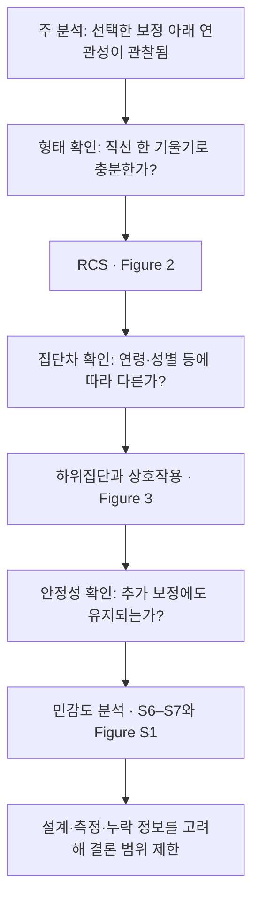

---
tags:
  - 염증과노쇠
  - 통계기초
순서: 20
---

# 10 곡선·집단차·민감도로 해석 점검

[[00-start 처음부터 따라가는 분석 흐름|전체 흐름]] · [[10-paper 10 Figure를 통해 결론의 범위 정하기|논문에 적용하기]]

> 들어오는 자료: 주 회귀분석에서 발견한 연관성 → 나오는 결과: 관계의 모양, 집단별 차이, 분석 선택에 대한 안정성.

## 여기서는 한 분석을 세 번 반복하는 것이 아니다

앞서 ‘연관성이 얼마나 큰가’를 OR로 요약했습니다. 이제 다른 질문을 세 가지 던집니다. 같은 분석 표를 사용하지만 새 질문마다 모형을 다시 적합합니다. 아래는 앞 단계에서 이어지는 **검토 순서**이며 저자의 실제 실행 시간 순서를 추정한 것이 아닙니다.

## RCS는 무엇을 입력받고 무엇을 그리나?

RCS는 restricted cubic spline, 제한적 3차 스플라인입니다. X축의 여러 위치에 매듭을 두고 구간별 3차식이 매끄럽게 연결되도록 하며, 양 끝에서는 선형 형태를 갖도록 제한합니다. 로그변환된 X로부터 만든 여러 항을 회귀에 넣습니다.

관심은 ‘X와 Y의 관계가 계속 같은 기울기인가’입니다. 직선 모형과 곡선 항을 포함한 모형을 비교해 비선형 성분이 필요한지 검정합니다. 매듭 위치·개수에 따라 유연성과 과적합 위험이 달라지므로 보고가 필요합니다.

세로축이 OR라면 보통 어떤 기준 X값에 대한 상대적인 오즈입니다. 곡선은 추정 관계, 음영은 추정의 95% CI입니다. 데이터가 드문 끝부분에서 불확실성이 커질 수 있으므로 곡선만 보고 극단값을 일반화하지 않습니다. 전체 연관성 p값과 비선형성 p값은 서로 다른 질문입니다.

## 하위집단과 상호작용은 무엇이 다른가?

여성의 OR, 남성의 OR를 각각 추정하는 것이 하위집단 분석입니다. 두 OR가 통계적으로 다른지를 묻는 것이 상호작용 검정입니다. ‘여성에서는 p<0.05이고 남성에서는 p>0.05’만으로 여성과 남성의 차이가 입증되지는 않습니다.

상호작용은 모형에 X×집단 항을 추가하는 형태로 표현할 수 있습니다. 로지스틱에서 이는 오즈비 척도의 효과 차이입니다. 절대 확률 차이의 상호작용과 같다고 가정하지 않습니다. 여러 하위집단을 탐색하면 우연히 유의한 결과가 나올 가능성도 커집니다.

## 민감도 분석은 왜 필요한가?

결과가 보정변수·결측 처리·지표 정의 같은 분석 선택에 얼마나 의존하는지 봅니다. 선택을 바꾸었을 때 결론이 달라지면 ‘틀렸다’고 즉시 결론내리기보다 **어떤 가정에서 관계가 유지되는가**를 명확히 해야 합니다. 민감도 분석은 무작위시험이나 외부 검증을 대신하지 않습니다.

## 여기까지 와도 말할 수 없는 것

여러 분석에서 연관성이 남아도 단면자료에 시간 순서가 새로 생기지는 않습니다. ‘염증을 낮추면 노쇠가 줄어든다’는 개입 효과나 개인의 미래 발병 확률은 별도 설계와 검증이 필요합니다.

<!-- V3-CONCEPT -->

## 하위집단에서 한쪽만 유의하면 집단 차이가 있는가?

남성에서는 p<0.05, 여성에서는 p>0.05였다고 해서 남녀의 연관성이 다르다고 결론 내릴 수 없습니다. 각 p값은 그 집단의 계수가 0인지 묻습니다. 남녀의 계수가 서로 같은지는 **상호작용 검정**이라는 별도의 질문입니다.

가령 `logit(p)=β0+β1 log(X)+β2 성별+β3 log(X)×성별+보정항`이면 기준 성별의 기울기는 β1, 다른 성별은 β1+β3입니다. 집단 차이는 β3=0을 검정합니다. 두 번째 집단 기울기의 불확실성에는 β1과 β3의 공분산까지 들어갑니다. 범주가 셋이면 관련 상호작용 항들을 함께 검정합니다.

여러 지표와 여러 집단 특성을 살피면 검정도 늘어납니다. 개별 그림의 점별 95% 구간과 여러 상호작용에 대한 다중검정 보정은 보호하는 범위가 다릅니다. 원 p값과 보정 p값, 전체 검정 수를 함께 읽어야 합니다.

---

[[09-paper 09 Table 3은 같은 데이터를 어떻게 다시 보나|이전: 09 Table 3은 같은 데이터를 어떻게 다시 보나]] · [[10-paper 10 Figure를 통해 결론의 범위 정하기|다음: 10 Figure를 통해 결론의 범위 정하기]]
