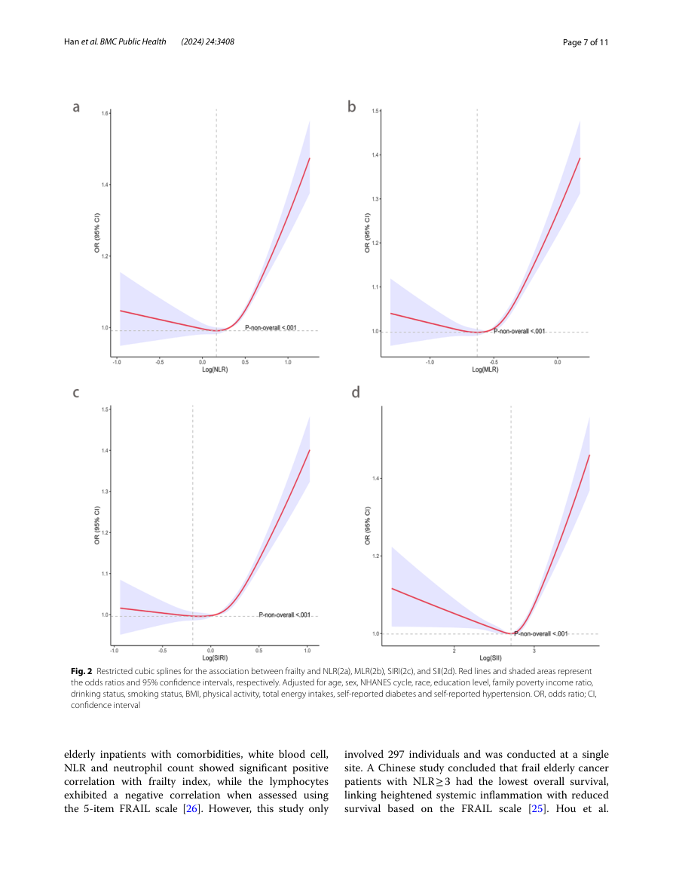
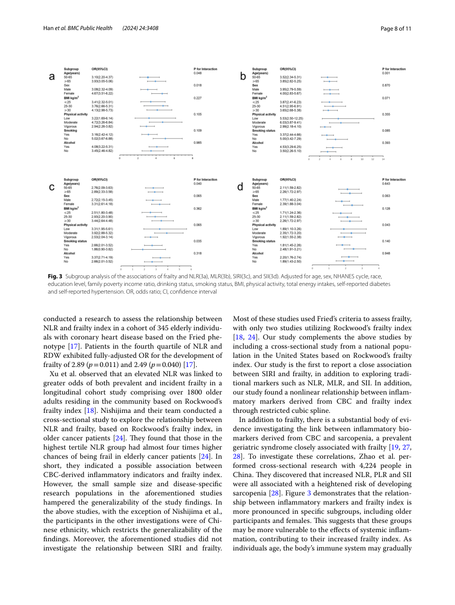
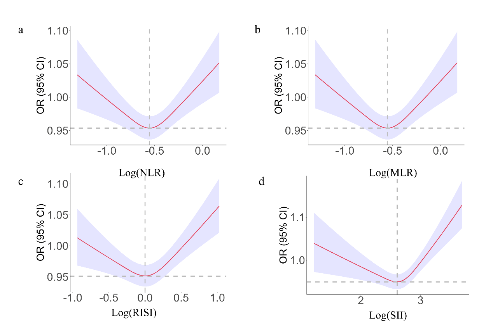
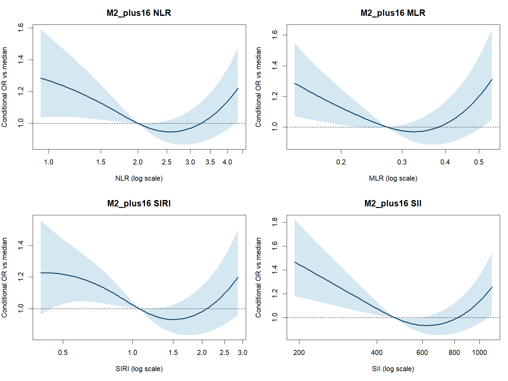
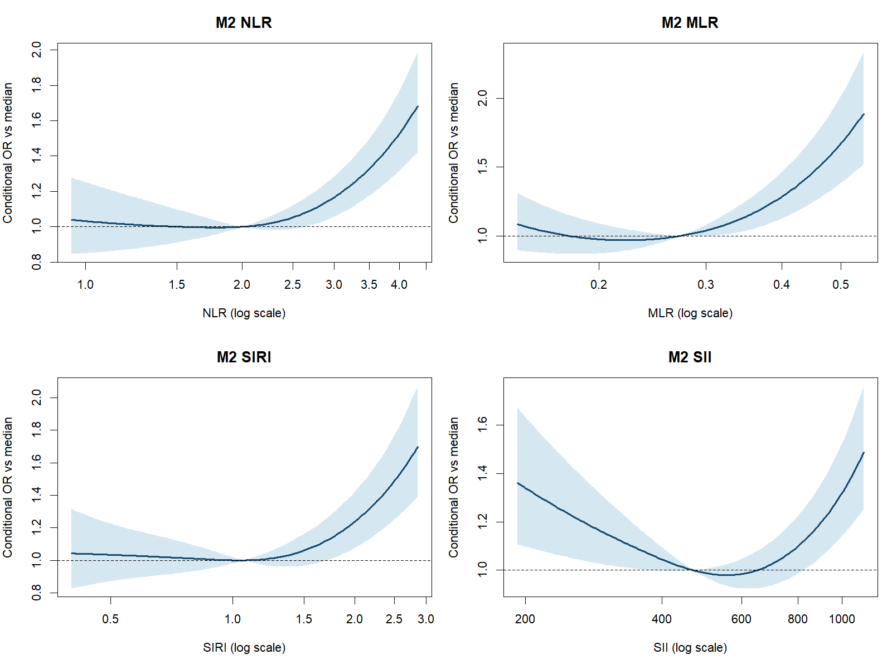
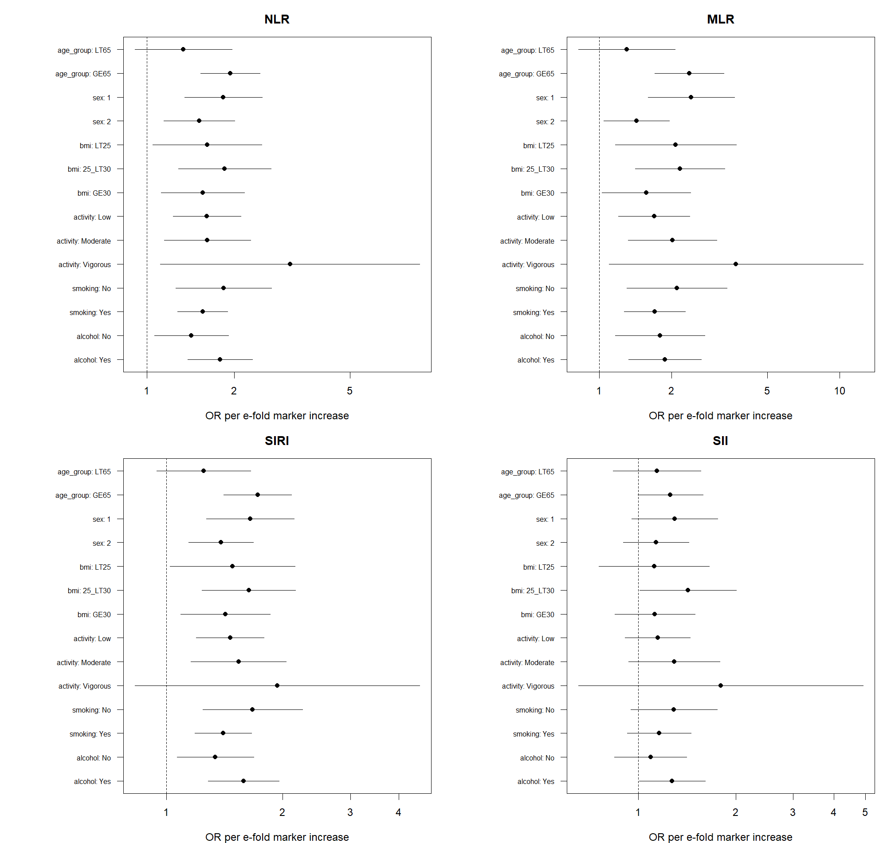
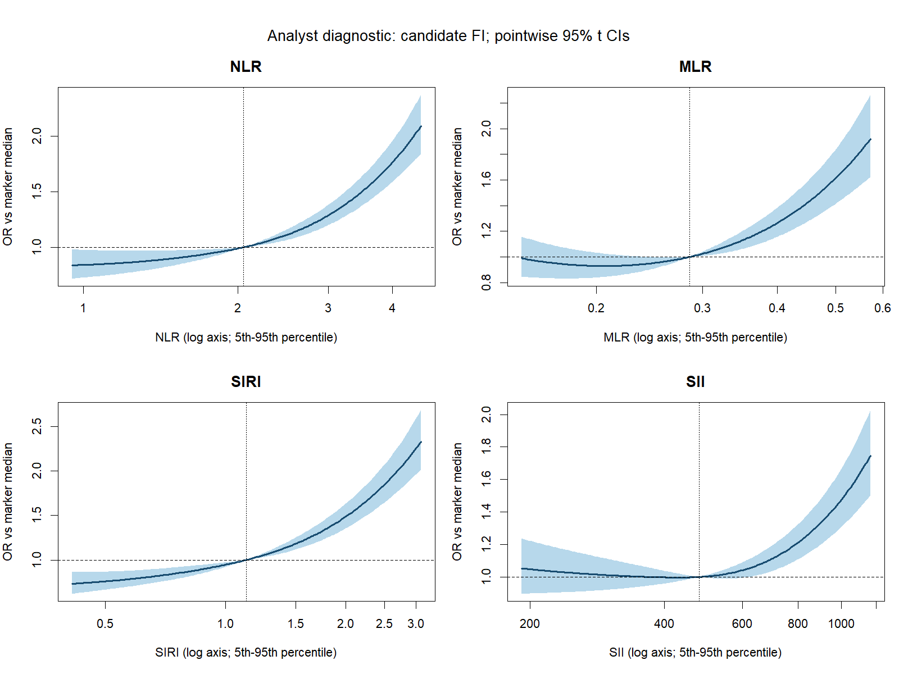
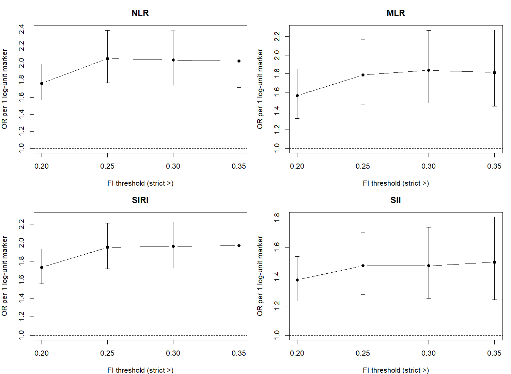
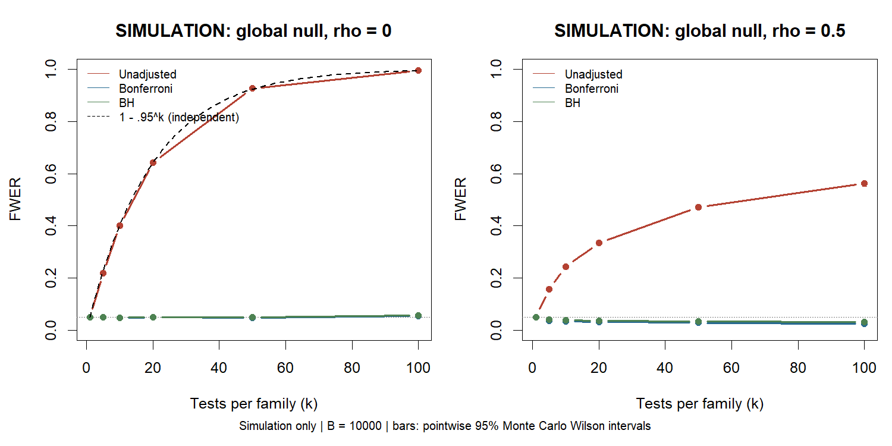
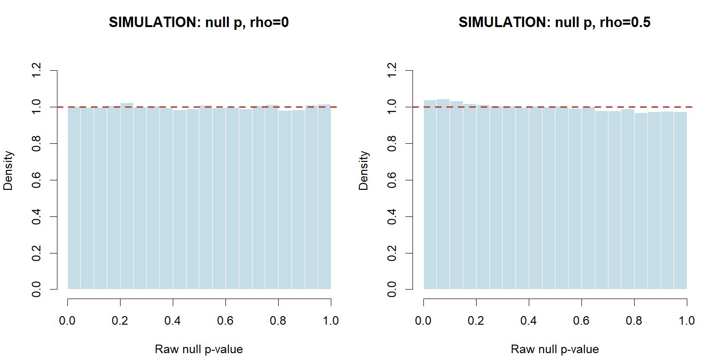

---
tags:
  - 염증과노쇠
  - 논문적용
순서: 21
---

# 10 Figure를 통해 결론의 범위 정하기

<!-- V2-LEARNING-STAGE-10 -->

> 읽는 순서: **논문 설명 → 남긴 의문 → 구현 → 재현 비교 → 추가 검토 → 갱신된 해석**. 개념이 막히면 위 통계 개념 노트로 돌아가세요.

## 1. 처음의 논문 설명과 데이터 흐름

> 아래는 구현 전에 작성한 원문 해설입니다. 당시의 미실행 설명은 이 구역의 작성 시점을 뜻하며, 이후 실제 실행 상태는 3–6구역에서 확인합니다.

[[00-start 처음부터 따라가는 분석 흐름|전체 흐름]] · [[10-concept 10 곡선·집단차·민감도로 해석 점검|통계 개념 배우기]]

> 논문 적용: Figures 2–3와 S1은 각각 관계의 형태, 집단차, 추가 보정에 대한 민감도를 설명합니다.

### Figure 2 — 높은 지표 구간에서 관계가 어떻게 변하나

a=NLR, b=MLR, c=SIRI, d=SII입니다. X축은 log 지표, Y축은 OR입니다. 저자들은 Model 2 공변량을 보정하고 비선형 관계를 보고했습니다. 그림은 낮은 구간에서 완만하게 낮아지거나 평탄하다가 높은 구간에서 올라가는 형태를 보입니다.

숫자 하나인 Table 2의 OR와 Table 3의 네 범주로는 이 굴곡을 충분히 설명하기 어렵습니다. 이것이 RCS 그림의 역할입니다. **곡선의 최저점은 검증된 임상 정상치나 치료 목표가 아닙니다.**

재현의 한계도 있습니다. 매듭 수·위치와 기준값, 곡선 계산의 세부 설정이 충분히 보고되지 않았습니다. 그림의 p값 표기는 ‘P-non-overall’로 모호한데 본문은 비선형성 검정을 설명합니다. 명확한 출력이나 코드 없이 그 표기를 임의로 정정하지 않습니다.

### Figure 3 — 같은 연관성이 모든 집단에서 같은가

점은 집단별 OR, 가로선은 95% CI입니다. 연령·성별·BMI·신체활동·흡연·음주로 나누어 비교합니다. 예를 들어 Figure 3a에서 NLR의 연령 상호작용 p=0.048, 성별 p=0.018이 표시됩니다. 전체 평균 OR에 가려질 수 있는 차이를 탐색하는 것입니다.

본문과 도표의 충돌도 있습니다. 본문은 SIRI와 흡연의 유의한 관계를 언급하지만, Figure 3c의 흡연 상호작용 p값은 0.141입니다. **흡연에 따른 효과 차이가 유의하다고 결론내리지 않습니다.** 집단 내부의 연관성과 집단 간 차이를 구별해야 합니다. 다중검정 보정의 명확한 보고도 확인되지 않아 탐색적으로 읽는 것이 적절합니다.

### Figure S1과 S6 — 더 보정해도 같은가

저자들은 Model 2에 심혈관질환·암·관절염·신장 상태·맥박·맥압·혈소판·여러 검사값을 추가해 회귀와 RCS를 다시 분석했습니다.

| 로그 지표 | 추가 보정 OR (95% CI) | p값 |
|---|---|---|
| NLR | 1.89 (1.37–2.60) | <0.001 |
| MLR | 1.30 (0.88–1.90) | 0.200 |
| SIRI | 1.44 (1.11–1.88) | 0.006 |
| SII | 1.63 (1.18–2.23) | 0.002 |

MLR는 추가 보정에서 통계적 유의성이 유지되지 않았습니다. 이는 ‘효과가 0임을 증명했다’는 뜻도, ‘네 지표 모두 똑같이 안정적이다’라는 뜻도 아닙니다. 선택한 모형에서 MLR 추정이 달라지고 불확실성이 1을 포함한다는 결과입니다.

추가 변수 다수는 FI 구성 항목과 겹칩니다. 그러므로 추가 보정 결과를 무조건 더 진실한 추정치라고 취급하지 않습니다. S1의 축·기준선·로그 표기도 명확하지 않아 최저점을 정량적 임상 기준으로 사용하지 않습니다.

### 이 논문에서 허용되는 결론

**미국 NHANES의 50세 이상 분석 표본에서, 선택한 정의의 노쇠 상태와 CBC 기반 지표 사이에 보정된 연관성이 관찰되었다. 관계의 형태와 집단차를 탐색했으며 추가 보정에 대한 안정성은 지표별로 달랐다.**

이 자료만으로 염증의 원인 효과, 노쇠 예방을 위한 치료 기준, 개인의 미래 노쇠 예측 성능까지 검증했다고 말할 수는 없습니다.

근거: [원문 Figures 2–3와 한계, PDF 7–9쪽](assets/paper.pdf#page=7), [보충자료 S6–S7, S1](assets/supplement.docx).

이제 처음부터 돌아보면 데이터의 역할을 정하고, 노쇠 정의와 대상자를 정한 뒤, 분포를 확인하고, 모형을 적합하고, 그 결론의 형태와 안정성을 점검했습니다. 각 방법은 이 흐름 안의 특정 질문에 답합니다.

## 2. 이 단계에서 남겨 둔 의문

**곡선·민감도·모의실험이 논문의 결론을 어디까지 지지하는가?**

정의 변경, 조사설계, 함수 형태와 이상적 검정 원리·실제 절차 검증의 적용 범위를 구분한다.

> 문제 `ISSUE-10` · 종류: 통계적 타당성 · 연결 작업: `V2-Q01`. 기록 ID를 몰라도 아래 설명을 읽을 수 있습니다.

## 3. 어떻게 구현했고 무엇을 얻었나

<!-- V3-STAGE-10 -->

### 후속 실행: 남은 논문 분석까지 구현

**Figure3의 하위집단 분석과 보충자료 분석을 마저 실행했습니다.** 연령·성별·BMI·활동·흡연·음주 6개 특성 × 지표4개의 상호작용을 각각 하나의 모형에서 검정했습니다.

| 지표 | 집단 특성 | 상호작용 원 p | 24검정 Holm p |
|---|---|---|---|
| NLR | age_group | 0.0974 | 1 |
| NLR | sex | 0.353 | 1 |
| NLR | bmi | 0.787 | 1 |
| NLR | activity | 0.454 | 1 |
| NLR | smoking | 0.39 | 1 |
| NLR | alcohol | 0.202 | 1 |
| MLR | age_group | 0.0202 | 0.485 |
| MLR | sex | 0.0217 | 0.5 |
| MLR | bmi | 0.533 | 1 |
| MLR | activity | 0.391 | 1 |
| MLR | smoking | 0.384 | 1 |
| MLR | alcohol | 0.851 | 1 |
| SIRI | age_group | 0.0527 | 1 |
| SIRI | sex | 0.242 | 1 |
| SIRI | bmi | 0.772 | 1 |
| SIRI | activity | 0.784 | 1 |
| SIRI | smoking | 0.244 | 1 |
| SIRI | alcohol | 0.225 | 1 |
| SII | age_group | 0.605 | 1 |
| SII | sex | 0.478 | 1 |
| SII | bmi | 0.573 | 1 |
| SII | activity | 0.611 | 1 |
| SII | smoking | 0.553 | 1 |
| SII | alcohol | 0.31 | 1 |

집단별로 한쪽만 유의하다는 비교가 아니라 집단 간 기울기 차이를 직접 검정한 결과입니다. 위 Holm은 24개 검정에 대한 보정입니다. 원문과 같은 연령·활동·음주 코딩이라고 확인된 것은 아닙니다.

**보충 S6·S7·FigureS1:** 동일한 사람에서 Model2와 질환·검사 16변수 추가 보정 모형을 비교하고, 연속 지표·사분위·추세·곡선을 계산했습니다.

| 지표 | Model2 OR | 추가 16변수 보정 OR |
|---|---|---|
| NLR | 1.66 (1.34–2.06) | 1.15 (0.929–1.43) |
| MLR | 1.85 (1.37–2.48) | 1.2 (0.895–1.61) |
| SIRI | 1.5 (1.26–1.79) | 1.12 (0.927–1.35) |
| SII | 1.21 (0.991–1.47) | 1.04 (0.84–1.29) |

추가 변수 중 일부가 FI 항목과 겹칩니다. 계수가 줄거나 커진 것을 더 올바른 인과효과로 단정하지 않습니다. 아래 곡선·숲그림은 후보 정의의 점별 95% 구간이며 저자 그래프의 동일 복제가 아닙니다. [하위집단 기울기와 인원](assets/V3-20260928T003525Z/subgroup_slopes.csv) · [상호작용 전체](assets/V3-20260928T003525Z/interactions.csv)

곡선 읽기: 대상은 동일 후보 10,874명이며, 가로축은 원척도 지표를 로그 간격으로 표시합니다. 기준은 각 지표의 표본 중앙값, 표시 범위는5–95백분위, 세로축은 기준 대비 조건부 OR입니다. 띠는 설계 자유도138의 t 임계값을 사용한 점별95% CI입니다. 인과적 위험 변화나 개인 예측확률이 아닙니다.

곡선 읽기: 대상은 동일 후보 10,874명이며, 가로축은 원척도 지표를 로그 간격으로 표시합니다. 기준은 각 지표의 표본 중앙값, 표시 범위는5–95백분위, 세로축은 기준 대비 조건부 OR입니다. 띠는 설계 자유도138의 t 임계값을 사용한 점별95% CI입니다. 인과적 위험 변화나 개인 예측확률이 아닙니다.

그림 읽기: sex 1=남성, 2=여성; LT65=50–64세, GE65=65세 이상; BMI LT25=<25, 25_LT30=25 이상30 미만, GE30=30 이상입니다. Low/Moderate/Vigorous는 정의한 여가활동 강도, smoking은 평생100개비 경험, alcohol은 어느 한 해12잔 이상 여부입니다. 같은 10,874명 모형에서 얻은 집단별 지표 e배 증가 OR와 점별95% CI이며, 집단 차이 검정은 별도 상호작용 표를 봅니다.

**상호작용 결과의 의미:** 24개 중 원 p<0.05인 비교가 있어도 Holm 보정 후 0.05 미만인 비교는 없었습니다. 특정 집단의 효과가 없다고 입증한 것이 아니라, 이번 후보 정의와 검정 가족에서는 집단 차이를 뒷받침할 보정 후 근거가 충분하지 않았다는 뜻입니다.

> 아래의 기존 V2 실행 내용은 당시 완비 후보의 기록입니다. 이번 후보와 표본·정의가 같다고 섞어 읽지 않습니다.

**새 진단 그림:** 아래는 원문 Figure2의 복제가 아니라, 이번에 고정한 자연스플라인의 조건부 OR 곡선입니다.

기준은 같은 표본에서 각 지표의 중앙값, 표시 범위는 5–95백분위입니다. 구간은 점별 95% CI이며 기준점과의 공분산을 반영했습니다. 다른 보정변수는 상호작용 없는 모형에서 대비할 때 상쇄됩니다.

| 지표 | 비선형 원 p | 4개 Bonferroni p | 분자/분모 자유도 |
|---|---|---|---|
| NLR | 3.5e-10 | 1.4e-09 | 2/138 |
| MLR | 3.65e-09 | 1.46e-08 | 2/138 |
| SIRI | 4.71e-06 | 1.88e-05 | 2/138 |
| SII | 2.03e-09 | 8.11e-09 | 2/138 |

원문의 knot·기준점·FI 코딩을 모르므로 곡선의 모양이 비슷하거나 다르다는 이유로 원문을 재현했거나 반박했다고 판정하지 않습니다.

새 곡선의 보정은 Model1(연령·성별·인종·조사주기)이며, 점별 구간은 설계 자유도 138의 t 임계값을 사용했습니다.

## 4. 논문과 비교하면 어디까지 일치하는가

원문 Figure1은 포함 대상, Table1은 분포, Table2–3은 보정 연관, Figure2는 함수 형태, Figure3은 집단별 연관을 설명합니다. 이번 분석은 이 역할을 연결했지만 원문 Figure2·3 수치 전체의 동일 재현은 아닙니다.

## 5. 의문을 검토한 과정과 추가 분석

**이미 수행한 민감도·모의실험을 재사용한 부분:** 다음 결과는 입력·코드 감사 후 유지했습니다. 동일 계산을 다시 실행한 결과로 표기하지 않습니다.

### 추가 분석·검정 검토: 무엇을 확인했고 무엇은 남았나

**FI 역치 민감도:** 같은 표본·같은 공변량에서 기준을 >0.20, >0.25, >0.30, >0.35로 바꿨습니다. 네 지표 모두 양의 연관 방향이 유지됐지만, 이것으로 0.3이 최적이라고 결론 내릴 수 없습니다. 각 기준은 서로 다른 이진 결과를 정의합니다.

**혈소판 중복:** FI36에서 혈소판 항목을 뺀 FI35를 동일한 사람의 fractional 모형에 넣었습니다. SII의 로그 계수는 0.1634→0.1823였습니다. 수학적 공유 한 항목에 대한 민감도이며, 모든 교란·공통 원인·측정오류가 사라졌다는 뜻은 아닙니다. 60세 이상으로 제한한 분석도 [모형 전체표](assets/analysis-20260928/runs/A02-models/model_sensitivities.csv)에 포함했습니다. 50세 미만은 이번 후보 자료에 없으므로 그 집단과 비교하여 최적 하한을 검증하지 않았습니다.

**모의실험 1 — 다중검정 원리:** `expand.grid`로 22개 조건, `Map`으로 반복 설계를 실행했습니다. 각 조건 B=10,000, seed를 고정했습니다. 알려진 분산의 z 검정을 이용하므로 실제 ANOVA 구현 확인과는 구분합니다. 독립 전역귀무에서 k=100 무보정 FWER 추정은 0.9945, 이론 1−0.95¹⁰⁰=0.99408입니다. 모든 독립 무보정 k 조건의 이론값이 해당 점별 95% Monte Carlo 구간 안에 있었습니다. 상관 0.5에서는 k=100 추정 0.5620으로 달랐으며 독립 공식을 강제로 맞추지 않았습니다.

귀무가설하 유효한 연속 p값의 균등 분포를 시각적으로 점검했습니다. 보정된 p값이나 실제 염증 자료의 p값까지 균등해야 하는 것은 아닙니다. **불편한 결과도 보존했습니다:** 독립 전역귀무 k=100에서 Bonferroni 추정 0.0556, BH 0.0573으로 각 Monte Carlo 구간이 0.05를 웃돌았습니다. 같은 seed의 사건을 독립 계산으로 대조했으며 seed를 다시 골라 성공처럼 만들지 않았습니다. 원인을 확정하지 않았고, 유한 모의실험이 이론을 증명하거나 모든 실행값이 0.05 이하임을 보장하지 않는다고 기록했습니다.

**모의실험 2 — 실제 비교 코드:** 실제 `comparison_core()`를 호출하여 군당 n=30, 4개 시나리오×B=2,000회를 실행했습니다. 다음은 기각 비율입니다.

| 생성 조건 | ANOVA | Welch | KW | 무엇을 읽는가 |
|---|---:|---:|---:|---|
| 정규 등분산 귀무 | .0495 | .0510 | .0450 | 명목 0.05와 경험적 크기 비교 |
| 정규 이분산·동일 평균 | .0615 | .0500 | .0610 | KW는 분포 동일 귀무가 거짓이므로 size가 아님 |
| 동일 lognormal 귀무 | .0410 | .0620 | .0500 | 왜도에서 근사 검정의 작동 확인 |
| 평균 차이가 있는 대립 | .4890 | .4785 | .4610 | 거짓 양성률이 아닌 검정력 |

lognormal에서 Welch 0.0620의 Monte Carlo 95% 구간은 0.05225–0.07343입니다. Welch가 모든 왜도 조건에서 정확한 수준을 유지한다고 쓰지 않습니다. 이 실험은 실제 표본의 크기·상관·복합표본을 그대로 재현하지 않았으며, 6쌍 family 검증으로 실제 24개 family 전체를 검증했다고 주장하지 않습니다. Tukey·HC3·FI 측정 타당성은 이 모의실험의 검증 범위 밖입니다.

[이론 대조·MC 구간](assets/analysis-20260928/runs/M01-simulation/theory_comparison.csv) · [원리 실험 전체](assets/analysis-20260928/runs/M01-simulation/simulation_summary.csv) · [실제 절차 실험](assets/analysis-20260928/runs/M02-procedure/omnibus_summary.csv) · [6쌍 다중비교 실험](assets/analysis-20260928/runs/M02-procedure/pairwise_summary.csv) · [독립 검토와 한계](assets/analysis-20260928/runs/M02-procedure/review.md)

**이번에 해결한 질문의 수준:** 실행 오류·가중치·선택·다중검정·코딩 민감도를 점검했습니다. 미공개 저자 정의를 확보하거나 FI의 임상적 타당성을 외부 자료로 검증한 것은 아닙니다. 원 논문과 정확히 같은 Model2·spline·그림의 수치 재현은 완료 표시하지 않습니다.

## 6. 갱신된 해석과 남은 한계

**후속 실행 상태:** 공개자료로 정의한 해당 후보 분석과 독립 검토를 완료했습니다. 저자 설정 확인·정확 재현 여부와 후보 구현 완료는 별도 판정입니다. 이전 판정은 아래에 이력으로 보존합니다.

**이전 V2 판정: 부분 해결 — 계산·진단은 수행했으나 저자 미공개 정의는 남음**

계산의 정확성, 방법의 조건부 적절성, 측정 타당성, 인과성은 서로 다른 판단이다.

새 계산은 독립 계획 검토 후 실행하고 별도 결과 검토를 거쳤습니다. 과거 자료·모형의 재사용 감사는 입력과 코드의 일관성을 확인한 것이며, 저자 FI 정의나 인과적 해석의 인증이 아닙니다.

