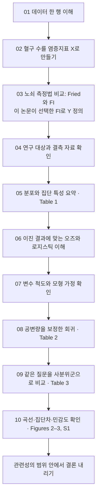
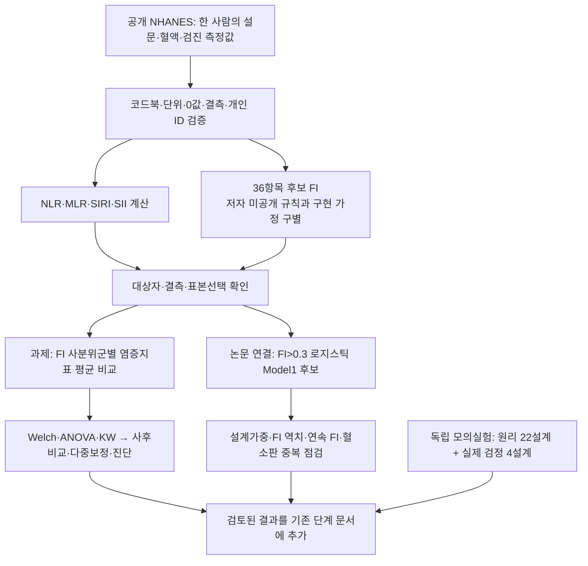

---
tags:
  - 염증과노쇠
  - 학습안내
순서: 1
---

# 처음부터 따라가는 분석 흐름

[[00-start 처음부터 따라가는 분석 흐름|전체 흐름]]

> 출발 질문: 혈구검사에서 계산한 염증지표가 높은 사람은, 같은 조사 시점에 노쇠 상태일 가능성이 더 높은가?

이 자료는 통계 용어의 사전이 아니라 **한 사람의 측정값이 분석 결과가 되는 과정**입니다. 각 단계는 ‘통계 개념 배우기’와 ‘논문에 적용하기’ 두 페이지로 나뉩니다. 먼저 개념을 읽고 같은 단계의 논문 적용으로 이동한 뒤 다음 단계로 넘어가세요.

논문 결과, 설명을 위한 가상 자료, 제가 제안하는 추가 분석을 구별해 표시합니다. 가상 자료로 논문을 재분석한 것처럼 설명하지 않습니다.

**여기서 시작하세요: [[01-concept 01 데이터 한 행과 변수의 종류|01 데이터 한 행부터 읽기]]**. 02단계에서는 염증의 측정법을, 03단계에서는 Fried와 FI를 비교해 노쇠의 측정법을 이해합니다. 이렇게 X와 Y를 정의한 뒤 두 변수의 연관성을 추정합니다.

## 출발점과 도착점

이 화살표는 **학습에 필요한 순서**입니다. 저자들이 실제로 코드를 실행한 시간 순서를 알고 있다는 뜻은 아닙니다. 특히 사분위 분석은 앞 단계의 OR를 다시 가공하는 단계가 아니라, 같은 분석 자료를 다른 형태의 설명변수로 다시 분석하는 보완 분석입니다.

## 원래 질문은 어디서 해결하나?

| 질문 | 읽을 단계 | 핵심 연결 |
|---|---|---|
| 7. 연속형과 범주형 | 01 | 한 행은 한 사람, 한 열은 한 변수 |
| 2. 다른 염증지표와 대표성 | 02 | 측정한 대상과 추론하는 개념 구별 |
| 3. FI와 0.3 이분화 | 03 | 복합지수 → 이진 결과 → 모형 선택 |
| 4. 단면자료·표적 관찰자료 | 04, 10 | 모집 방법·시간 구조·인과성 구별 |
| 5. 50세 미만·공변량 결측 | 04 | 목표 모집단과 분석 가능 표본 |
| 8. 중앙값·IQR·빈도·비율 | 05 | 원자료 → 요약값, 실제 숫자로 계산 |
| 1. 왜 오즈인가 | 06 | 확률 → 오즈 → 로그오즈 → OR |
| 9. 로지스틱의 가정 | 07 | 설명변수 분포와 관계의 형태 구별 |
| 6. Model 1과 Model 2 | 08 | 보정하는 변수 집합의 차이 |
| 10. 사분위 구분의 효과 | 09 | 범주화와 교란 보정은 서로 다름 |

## 매 페이지에서 같은 네 가지를 확인한다

**읽기 시작:** [[01-concept 01 데이터 한 행과 변수의 종류|01 데이터 한 행과 변수의 종류]] → 같은 단계의 ‘논문 적용’ → 다음 단계.

| 단계 | 개념 | 논문 적용 |
|---|---|---|
| 01 | [[01-concept 01 데이터 한 행과 변수의 종류|원자료와 자료형]] | [[01-paper 01 논문 데이터의 모양|NHANES 변수의 형태]] |
| 02 | [[02-concept 02 염증을 무엇으로 측정하는가|염증의 측정]] | [[02-paper 02 논문에서 네 지표를 만든 방법|네 지표의 계산]] |
| 03 | [[03-concept 03 FI와 노쇠 여부를 구별하기|Fried·FI 비교와 결과변수 정의]] | [[03-paper 03 이 논문은 FI를 어떻게 정의했나|FI 선택 이유·36항목·0.3 기준]] |
| 04 | [[04-concept 04 누구를 언제 관찰했는가|모집단·시간·결측]] | [[04-paper 04 표본 선정과 단면자료의 한계|표본 선정과 한계]] |
| 05 | [[05-concept 05 중앙값·IQR·빈도·비율 직접 계산|기술통계 계산]] | [[05-paper 05 Table 1을 읽는 순서|Table 1 읽기]] |
| 06 | [[06-concept 06 확률에서 오즈와 로지스틱으로|확률·오즈·로지스틱]] | [[06-paper 06 이 논문의 OR를 정확히 읽기|OR의 정확한 의미]] |
| 07 | [[07-concept 07 로그변환과 로지스틱의 가정|로그변환과 가정]] | [[07-paper 07 논문이 한 전처리와 보고하지 않은 점검|전처리와 보고 공백]] |
| 08 | [[08-concept 08 공변량 보정과 두 모형의 목적|보정의 목적]] | [[08-paper 08 Table 2의 Model 1과 Model 2|Model 1과 Model 2]] |
| 09 | [[09-concept 09 사분위군은 보정이 아니라 비교 방식|사분위군]] | [[09-paper 09 Table 3은 같은 데이터를 어떻게 다시 보나|Table 3 읽기]] |
| 10 | [[10-concept 10 곡선·집단차·민감도로 해석 점검|보완 분석의 역할]] | [[10-paper 10 Figure를 통해 결론의 범위 정하기|Figure와 결론의 범위]] |

학습 후에는 [[11-learning-level 다음 설명을 위한 사전지식 수준|나의 사전지식 수준과 설명 방식]], [[12-reusable-prompt 다음 논문에도 사용할 요청 프롬프트|재사용 프롬프트]], [[13-sources 근거와 용어 찾아보기|근거와 용어 사전]]을 볼 수 있습니다.

1. **들어오는 자료**: 현재 무엇을 알고 있는가?
2. **이번 질문**: 왜 다음 계산이 필요한가?
3. **나오는 결과**: 어떤 숫자나 그림을 얻게 되는가?
4. **다음 단계**: 그 결과만으로 무엇을 아직 말할 수 없는가?

표와 그림의 역할도 다릅니다. Table 1은 자료의 모습을, Tables 2–3은 보정된 연관성의 수치를, Figure 2는 형태를, Figure 3은 집단차를 보여줍니다. Figure 1은 이 모든 결과에 사용된 사람들을 정의합니다.

## 두 형식 비교 방법

HTML에서는 이전·다음과 단계별 두 페이지 전환을 사용합니다. FI와 오즈 페이지에서 값을 바꿔 볼 수 있습니다. Obsidian에서는 같은 순서의 노트와 위키링크, Mermaid 도식을 사용합니다. 계산 예시와 핵심 설명은 두 형식에 동일하게 들어 있습니다.

HTML 시작 파일은 `frailty-learning/dist/index.html`입니다. Obsidian에서는 기존 보관함 안의 `염증과 노쇠 - 분석 길잡이` 폴더에서 이 노트를 여세요. 기존 보관함 설정을 바꾸지 않아도 읽을 수 있습니다.

---

[[01-concept 01 데이터 한 행과 변수의 종류|다음: 01 데이터 한 행과 변수의 종류]]

시각적으로 이동하기: [[분석 흐름.canvas|개념과 적용을 연결한 Canvas]]

<!-- NHANES-EXECUTION-20260928-v1 -->

## 공개 NHANES로 실행한 분석 — 2026-09-28 추가

**현재 위치:** 코드 작성에 이어 공개자료 분석·통계 검토·모의실험까지 실행했습니다. 아래 결과는 저자 코드가 확인된 완전 재현이 아니라, 미공개 FI 규칙을 명시적으로 정한 **operational36 재구성 후보**의 분석입니다. 논문의 13,507명과 동일한 분석집단이라고 주장하지 않습니다.

공개 9개 조사 주기 전체 92,062명 → 50세 이상 24,119명 → 후보 FI 36항목 완비 9,814명 → 네 혈액지표 분석 9,786명입니다. 같은 FI 값은 같은 군에 두므로 FI군의 인원은 정확히 25%씩 나뉘지 않습니다.

| 확인할 내용 | 기존 문서의 추가 부분 |
|---|---|
| 한 사람의 혈구 수 → 염증지표 → FI와 군 | [[01-paper 01 논문 데이터의 모양|01-paper]], [[02-paper 02 논문에서 네 지표를 만든 방법|02-paper]], [[03-paper 03 이 논문은 FI를 어떻게 정의했나|03-paper]] |
| 왜 최종 표본이 줄고 인구 비율이 달라지는가 | [[04-paper 04 표본 선정과 단면자료의 한계|04-paper]], [[05-paper 05 Table 1을 읽는 순서|05-paper]] |
| OR·가정·보정 회귀와 연속 FI의 차이 | [[06-paper 06 이 논문의 OR를 정확히 읽기|06-paper]], [[07-paper 07 논문이 한 전처리와 보고하지 않은 점검|07-paper]], [[08-paper 08 Table 2의 Model 1과 Model 2|08-paper]] |
| 과제의 실제 군 비교 결과·사후검정·경향성 | [[09-paper 09 Table 3은 같은 데이터를 어떻게 다시 보나|09-paper]] |
| 검정이 제대로 작동하는가·추가 분석의 한계 | [[10-paper 10 Figure를 통해 결론의 범위 정하기|10-paper]] |

네 지표의 FI군 평균 차이는 다중보정 후에도 관찰됐습니다. 그러나 50–59세는 16.5%, 60세 이상은 50.9%만 후보 FI 완비자로 남았습니다. 이는 대표성과 결측 선택을 검토해야 한다는 결과이며, 작은 p값으로 해결되지 않습니다. FI 코딩 세 규칙을 함께 바꾸자 같은 9,814명 중 250명의 이진 분류, 1,412명의 사분위군이 바뀌었습니다.

**실행과 설명의 위치:** [R 구현·VS Code 실행 안내](assets/analysis-20260928/README.md), [작업 명세·의존관계](assets/analysis-20260928/memory/task_registry.json), [현재 상태와 제한](assets/analysis-20260928/memory/progress.md), [이벤트 로그](assets/analysis-20260928/memory/events.jsonl). 문서의 설명을 분석 코드 대신 사용하지 않습니다. 이번에는 기존 Markdown과 Obsidian 노트에 결과를 추가했으며, HTML은 다시 생성하지 않았습니다.

**아직 판정할 수 없는 부분:** 저자와 정확히 같은 FI/결측 처리, 논문 표본수의 완전 일치, Model2 전체 및 원문 spline 설정의 동일 재현. 미공개 정의를 추정하여 출판 수치에 맞추는 대신 확인되지 않은 것으로 남겼습니다. 이번 완료 범위는 과제에 필요한 군 비교·모의실험과 명시된 후보 자료의 추가 타당성 점검입니다.

> Obsidian의 그림·근거 링크는 보관함 내부의 이번 실행 스냅샷입니다. 실행 코드·자료의 기준 원본은 상위 작업 폴더의 `analysis/`이며, 새 분석을 실행하면 스냅샷도 검토 후 갱신해야 합니다.

<!-- PROTOCOL-V2-NAVIGATION -->
## 문서와 운영 프롬프트를 읽는 위치

이 폴더가 앞으로 학습 설명과 검토 결과를 읽고 갱신하는 기준 위치입니다. 통계 개념은 concept, 논문 설명·의문·구현·검토는 해당 paper 노트를 따라가세요.

새 논문에도 같은 방식으로 실행하려면 [[12-reusable-prompt 다음 논문에도 사용할 요청 프롬프트|요청 방법]]과 [[4주차 과제 - 에이전트 실행 설계/05-prompts|전체 오케스트레이션 프롬프트 v2.0]]를 사용합니다. 운영 기록을 읽어야 본문을 이해할 수 있도록 만들지 않습니다. 이번 프롬프트 개정은 기존 분석을 다시 실행한 것이 아닙니다.
