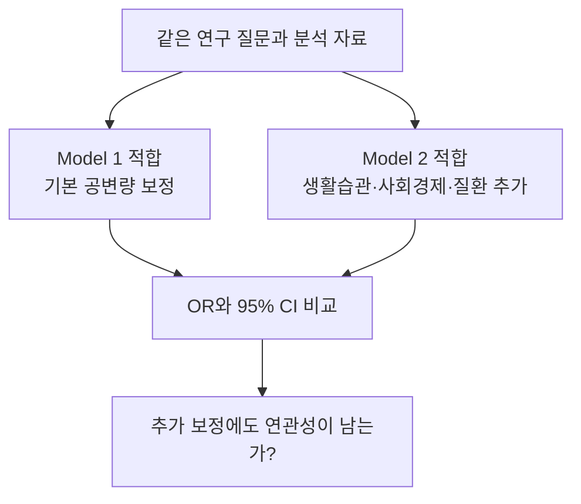

---
tags:
  - 염증과노쇠
  - 논문적용
순서: 17
---

# 08 Table 2의 Model 1과 Model 2

[[00-start 처음부터 따라가는 분석 흐름|전체 흐름]] · [[08-concept 08 공변량 보정과 두 모형의 목적|통계 개념 배우기]]

> 논문 적용: 단계적으로 보정범위를 넓혀도 관심 지표와 노쇠의 연관성이 남는지 확인합니다.

## 모형에 무엇이 들어가나?

| 요소 | Model 1 | Model 2 |
|---|---|---|
| Y | FI>0.3 여부 | 동일 |
| 관심 X | 로그변환한 염증지표 | 동일 |
| 기본 공변량 | 연령, 성별, 인종, 조사 주기 | 모두 유지 |
| 추가 공변량 | 없음 | 교육, 소득비, BMI, 신체활동, 에너지 섭취, 흡연, 음주, 당뇨, 고혈압 |

## 실제 숫자를 읽는다

| 로그 지표 | Model 1 OR (95% CI) | Model 2 OR (95% CI) |
|---|---|---|
| NLR | 4.85 (3.60–6.54) | 3.45 (2.52–4.73) |
| MLR | 3.46 (2.41–4.95) | 3.58 (2.44–5.25) |
| SIRI | 4.09 (3.24–5.17) | 2.77 (2.17–3.55) |
| SII | 2.39 (1.84–3.11) | 1.89 (1.44–2.48) |

모두 보고된 p<0.001입니다. NLR·SIRI·SII는 OR가 작아졌지만 MLR는 조금 커졌습니다. 보정이란 OR를 항상 줄이는 과정이 아닙니다. 해석은 **‘선택한 공변량을 고려한 뒤에도 양의 연관성이 관찰되었다’**까지입니다.

## 이 표가 답하지 않는 것

- 네 지표 중 어떤 것이 미래 노쇠를 가장 잘 예측하는지는 AUC·교정·외부 검증 등을 확인해야 합니다. OR가 큰 순서로 예측력 순위를 매기지 않습니다.
- Model 2가 모든 교란을 제거했다는 뜻은 아닙니다.
- 당뇨·고혈압은 FI 구성에도 관련됩니다. 결과 구성 항목을 보정한 해석에는 주의가 필요합니다.
- 지표 네 개가 서로 독립적인 원인이라는 뜻이 아닙니다.

근거: [원문 Table 2와 각주, PDF 6쪽](assets/paper.pdf#page=6).

현재 결과는 log(X) 한 단위 증가에 대한 요약입니다. 다음은 같은 데이터를 ‘높은 지표군 대 낮은 지표군’으로 다시 표현해 비교합니다.

---

[[08-concept 08 공변량 보정과 두 모형의 목적|이전: 08 공변량 보정과 두 모형의 목적]] · [[09-concept 09 사분위군은 보정이 아니라 비교 방식|다음: 09 사분위군은 보정이 아니라 비교 방식]]

<!-- NHANES-EXECUTION-20260928-v1 -->

## 실행·검토: 보정 모형과 결과변수 변경을 분리하기

**실행한 논문 연결 모형:** 각 지표를 하나씩 자연로그 변환하고 연령·성별·인종·조사주기를 보정했습니다. 후보 FI>0.3의 Model1 구조입니다. 조사 설계를 적용한 결과는 다음과 같습니다. 전부 동일한 9,786명을 사용하며, CI는 점별 구간입니다.

| 지표 | OR / 자연로그 1단위 | 95% CI |
|---|---|---|
| NLR | 2.036 | 1.740–2.381 |
| MLR | 1.837 | 1.490–2.264 |
| SIRI | 1.961 | 1.727–2.226 |
| SII | 1.475 | 1.252–1.737 |

비가중 Model1도 함께 저장했습니다. 이것은 두 분석집단을 혼합한 비교가 아닙니다. Model2의 신체활동·식이 등 정의와 결측 조건을 저자와 동일하게 확인하지 못해, 이를 임의 조합한 모형을 Model2 재현이라고 부르지 않았습니다. Model1과 Model2의 차이는 통계기법의 우열이 아니라 보정하는 정보의 차이입니다.

**연속 FI 대안:** 설계 기반 `svyglm(..., family=quasibinomial())`으로 E(FI|X)의 logit을 추정했습니다. 0·1도 평균 모형의 입력이 될 수 있으며, 일반 `quasibinomial` 이름만으로 robust 표준오차가 생기는 것은 아닙니다. 여기서는 survey 설계로 표준오차를 계산했습니다. beta regression은 (0,1) 연속 분포 가정과 경계값 처리를 추가로 요구합니다. 이 후보 FI는 1/36 간격의 이산 점수이므로 이번 대안은 평균 구조를 직접 다루는 fractional logit으로 고정했습니다. beta regression이 항상 불가능하다는 뜻은 아닙니다.

| 지표 | 낮은 지표값에서 조정 평균 FI | 높은 지표값에서 조정 평균 FI | 차이 |
|---|---|---|---|
| NLR | 0.1619 | 0.1859 | 0.0239 |
| MLR | 0.1662 | 0.1823 | 0.0162 |
| SIRI | 0.1583 | 0.1884 | 0.0302 |
| SII | 0.1663 | 0.1827 | 0.0164 |

여기서 낮음/높음은 해당 로그 지표의 비가중 25·75백분위입니다. 다른 공변량은 관측 분포에 두고 가중 평균 예측했습니다. 위 값은 예측 점추정치이며 CI를 계산하지 않았습니다. 인과적 개입 효과도 아닙니다. **fractional 모형의 exp(β)를 ‘노쇠 여부 OR’로 해석하면 안 됩니다.**

[32개 모형 계수·SE·CI·수렴·탐색적 BH 결과](assets/analysis-20260928/runs/A02-models/model_sensitivities.csv) · [fractional 예측 정의와 값](assets/analysis-20260928/runs/A02-models/fractional_mean_predictions.csv) · [독립 코드 검토](assets/analysis-20260928/runs/S01-paper-contract/extensions_review.md)

> Obsidian의 그림·근거 링크는 보관함 내부의 이번 실행 스냅샷입니다. 실행 코드·자료의 기준 원본은 상위 작업 폴더의 `analysis/`이며, 새 분석을 실행하면 스냅샷도 검토 후 갱신해야 합니다.
