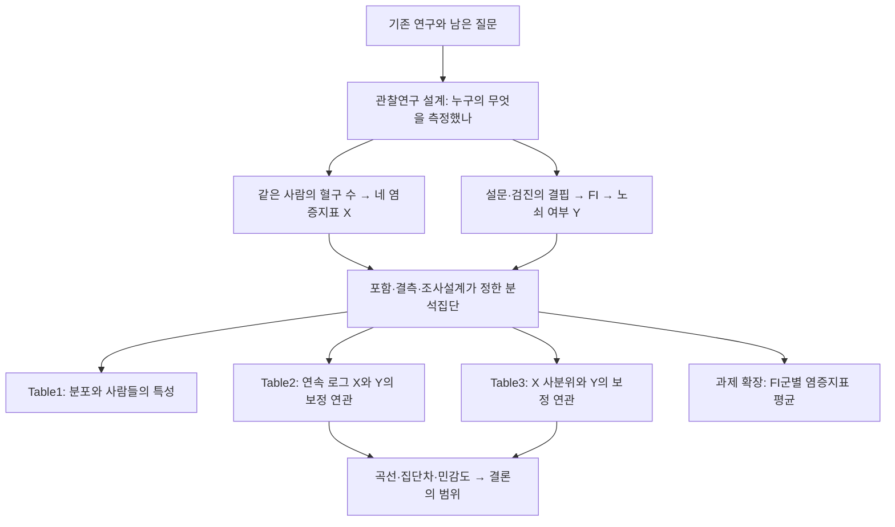

# 한 사람의 측정값에서 논문의 결론까지

이 문서는 **논문을 이해하면서 구현과 검토 결과를 같은 순서로 읽는 시작점**입니다. 코드나 로그를 먼저 읽을 필요는 없습니다.

저자는 염증과 노쇠에 관한 선행연구에서 출발해, 미국 NHANES 자료에서 네 혈구 유래 지표와 FI 노쇠 여부의 연관성을 묻습니다. 새 실험으로 사람을 배정한 연구가 아니라 기존 관찰자료를 선택·코딩·분석한 연구입니다. 같은 사람의 혈구 수와 설문·검진 값이 각각 설명변수와 결과변수로 바뀌고, 여러 사람의 자료를 모아 효과와 불확실성을 추정합니다.

화살표는 설명을 위한 데이터·질문의 관계입니다. Table1의 요약값을 회귀의 원자료로 넣는다는 뜻은 아닙니다. 과제 확장은 논문과 X·Y의 역할이 다릅니다.

## 읽는 방법

각 단계에서 concept를 먼저 읽으면 통계·데이터의 특징을 배우고, paper에서 이 논문이 무엇을 했는지 확인합니다. paper에는 처음 남긴 의문, 실제 구현, 원문과의 비교, 추가 검토와 남은 한계가 같은 순서로 이어집니다.

| 단계 | 먼저 이해할 개념 | 논문 설명·구현·검토 |
|---|---|---|
| 01 연구 질문과 관측 단위 | [[01-concept 01 데이터 한 행과 변수의 종류|개념]] | [[01-paper 01 논문 데이터의 모양|논문과 실제 분석]] |
| 02 혈구 측정과 설명변수 | [[02-concept 02 염증을 무엇으로 측정하는가|개념]] | [[02-paper 02 논문에서 네 지표를 만든 방법|논문과 실제 분석]] |
| 03 노쇠 측정과 결과변수 | [[03-concept 03 FI와 노쇠 여부를 구별하기|개념]] | [[03-paper 03 이 논문은 FI를 어떻게 정의했나|논문과 실제 분석]] |
| 04 표본 선정·결측·설계 | [[04-concept 04 누구를 언제 관찰했는가|개념]] | [[04-paper 04 표본 선정과 단면자료의 한계|논문과 실제 분석]] |
| 05 기술통계와 Table1 | [[05-concept 05 중앙값·IQR·빈도·비율 직접 계산|개념]] | [[05-paper 05 Table 1을 읽는 순서|논문과 실제 분석]] |
| 06 이진 결과와 오즈 | [[06-concept 06 확률에서 오즈와 로지스틱으로|개념]] | [[06-paper 06 이 논문의 OR를 정확히 읽기|논문과 실제 분석]] |
| 07 척도·가정·진단 | [[07-concept 07 로그변환과 로지스틱의 가정|개념]] | [[07-paper 07 논문이 한 전처리와 보고하지 않은 점검|논문과 실제 분석]] |
| 08 보정 모형과 Table2 | [[08-concept 08 공변량 보정과 두 모형의 목적|개념]] | [[08-paper 08 Table 2의 Model 1과 Model 2|논문과 실제 분석]] |
| 09 설명변수 사분위와 Table3 | [[09-concept 09 사분위군은 보정이 아니라 비교 방식|개념]] | [[09-paper 09 Table 3은 같은 데이터를 어떻게 다시 보나|논문과 실제 분석]] |
| 10 그림·민감도·결론 | [[10-concept 10 곡선·집단차·민감도로 해석 점검|개념]] | [[10-paper 10 Figure를 통해 결론의 범위 정하기|논문과 실제 분석]] |

## 이번 실행으로 무엇을 더 알게 됐나

- 한 사람의 자료 구조와 연구 질문을 먼저 연결했습니다. 출판 수치·가상 예시·후보 자료 결과를 구별합니다.
- 기존 후보 분석은 코드와 입력이 유지됐는지 감사한 뒤 재사용했습니다. 저자와 동일한 FI라는 뜻은 아닙니다.
- 로그의 밑을 바꾸면 숫자로 표시한 OR는 달라져도 같은 배수 변화와 적합 확률은 같다는 점을 실제 모형으로 검사했습니다.
- 논문 방향인 **염증지표 사분위 → 노쇠 여부** Model1을 추가하고, 과제의 **FI 사분위 → 염증지표 평균**과 구분했습니다.
- 연령 경계와 로그 지표의 함수 형태를 계획에 따라 검사했습니다. 구체적인 결과는04·06·07·09·10단계에서 읽습니다.

## 무엇이 아직 해결되지 않았나

저자의 FI 세부 코딩·결측 허용·로그 밑·일부 Model2 정의·RCS 설정은 모두 확인되지 않았습니다. 현재 분석집단은 명시한 operational36 후보입니다. 따라서 논문 전체를 동일하게 재현했다는 결론은 내리지 않습니다. 모형을 잘 실행했다는 것, 통계적 가정이 적절하다는 것, 노쇠를 타당하게 측정했다는 것, 인과관계를 밝혔다라는 것은 각각 다른 판단입니다.

운영 프롬프트가 필요할 때만 [[12-reusable-prompt 다음 논문에도 사용할 요청 프롬프트|재사용 프롬프트]]를 읽으세요. 실제 코드·자료·로그의 기준은 작업 폴더의 `analysis/`입니다. 이번 내용은 기존 Obsidian 문서에서 갱신했고 HTML은 별도로 만들지 않았습니다.
