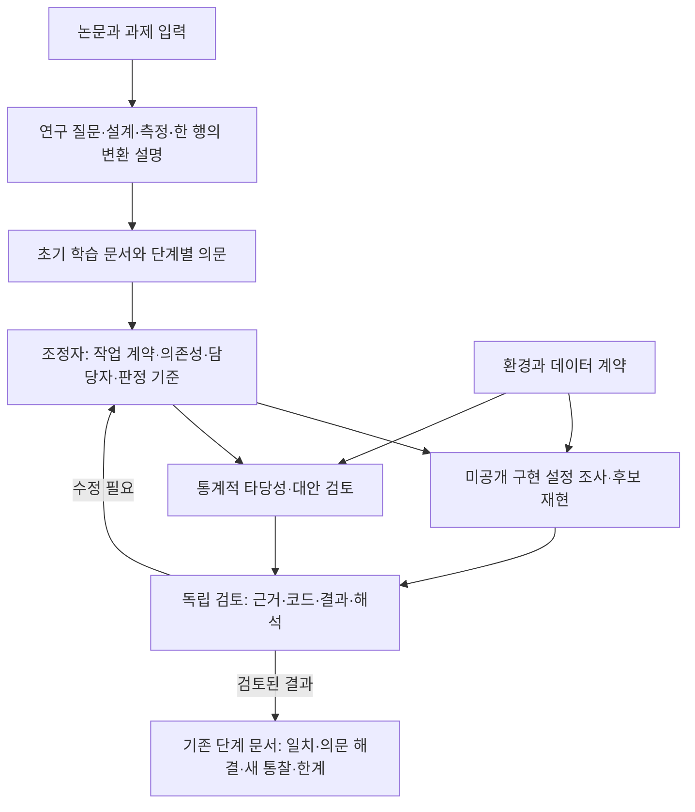

# 논문 흐름을 따라 이해하고 구현·검토하기

이 페이지는 운영 안내입니다. **실행 지시의 기준은 [05-prompts.md](05-prompts.md)의 v2.0**입니다. 그 파일 안에 전체 프롬프트·파일 구조·역할·소통·판정 규칙이 있습니다.

사용자가 읽는 중심은 기존 `염증과 노쇠 - 분석 길잡이`의 단계별 concept/paper 문서입니다. 연구 질문과 한 관측 단위의 변환을 설명한 뒤, 해당 단계의 의문을 작업으로 만들고 검토된 결과를 같은 단계에 되돌려 넣습니다.

논문과 다른 질문을 요구하는 과제는 별도 확장으로 표시합니다. 작업 완료 시간과 문서 읽기 순서는 다를 수 있습니다. 결과를 초기 문서의 해당 위치에 반영하고 새 HTML/최종 보고서를 기본 산출물로 만들지 않습니다.

기존 `analysis/`에는 공개 NHANES와 operational36 후보 분석이 이미 있습니다. 이전 ‘자료 미연결’이라는 안내는 현재 상태가 아닙니다. 이 운영 설계 개정은 그 분석을 재실행하거나 저자와 동일한 재현으로 재분류하지 않습니다.
