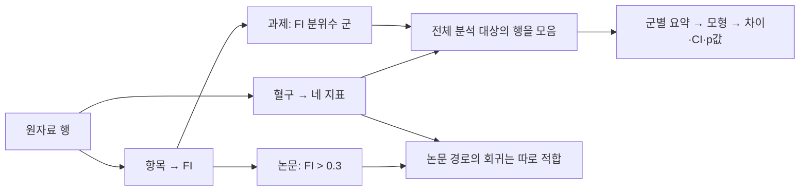

> **이전 v1 설계 보관 문서입니다.** 아래 내용은 당시의 계획이며 현재 실행 지시가 아닙니다. 현재의 역할·경로·우선순위·완료 기준은 [v2 실행 프롬프트](05-prompts.md)를 따릅니다. 당시 “미연결/미실행”은 현재 분석 상태를 뜻하지 않습니다.

# 한 사람의 행이 분석 결과로 이어지는 경로

한 사람의 관측값이 혼자 p값이나 OR를 만드는 것은 아닙니다. 개인별 행을 정의하고, 여러 사람의 값을 함께 사용해 집단 요약과 모형의 계수를 추정합니다.

## 같은 가상 인물을 끝까지 추적

학습자료의 가상 인물 F를 유지합니다. 혈구 수 단위는 10³/μL이며 N=4.8, L=2.0, M=0.6, P=250, FI 결손은 36개 중 14개입니다. 실제 NHANES 참여자 기록이 아닙니다.

| 변환 | F에게 생기는 값 | 보존할 근거 |
|---|---|---|
| 원자료 병합 | 개인 ID·조사 주기·혈구·FI 항목·공변량 | 파일 버전, join 키, 중복 검사, 코드북 |
| 혈구 단위 통일 | N/L/M/P의 일관된 단위 | 원열, 원단위, 변환식 |
| 지표 생성 | NLR=2.4, MLR=0.30, SIRI=1.44, SII=600 | 계산 코드, 분모 0 처리, 결측 플래그 |
| FI 생성 | 14/36 ≈ 0.389 | 항목별 점수, 유효 분모, 허용 결측 |
| 논문 경로 A | FI>0.3이므로 Y=1 | 기준과 경계 포함 규칙 |
| 과제 경로 C | FI 사분위군은 아직 결정할 수 없음 | 전체 분석 집단의 분위수·동점 규칙 필요 |
| 가상 군 경계 적용 | 경계가 0.18·0.25·0.35라면 Q4 | 이 경계는 교육용 가정, 실제 분석값 아님 |
| 집단 분석 | F의 NLR=2.4가 Q4의 관측값 중 하나가 됨 | 지표별 실제 분석 인원과 제외 이유 |
| 추정·보고 | 전체 참여자의 값으로 Q4 평균·차이·CI 등을 추정 | 데이터/계획/코드 해시와 실행 ID |

## 산출물을 세 층으로 구분

1. **개인 수준:** `participant_key, cycle, include_flag, exclusion_reason, FI_numerator, FI_denominator, FI, FI_group, NLR, MLR, SIRI, SII` 및 필요한 조사설계 열.
2. **집단 수준:** 지표·군별 n, 가중 분모(해당 시), 평균/SD, 중앙값/사분위수, 누락 수.
3. **검정 수준:** 질문 ID, 추정 대상, 비교 군, 추정치, SE/CI, 원 p값, 보정 p값, family_id, 분석 인원, 수렴/실패 상태.

실제 열 이름은 코드북 매핑을 거쳐 확정합니다. 설계 변수 이름을 관행만으로 확정하지 않습니다. ID는 개인을 중복 집계하지 않도록 검사하고, 여러 주기 병합 시 키의 유일성을 확인합니다.

## 행 수준 추적의 검사

- 원자료 ID가 분석 테이블에서 왜 남거나 제외됐는지 확인할 수 있어야 합니다.
- 제외 규칙이 여러 개 겹치면 순차 제외 수와 중복 결측 패턴을 구분합니다.
- FI 군 경계는 정한 기준집단에서 한 번 계산합니다. 지표별 결측 때문에 군 경계를 매번 바꾸지 않습니다. 다른 규칙을 택하면 계획 변경으로 기록합니다.
- log 변환·FI 대체 정의는 원열을 덮어쓰지 않고 파생열/새 데이터 버전으로 만듭니다.
- 자료가 이미 FI만 제공하면 36개 항목 계산을 검증했다고 주장하지 않습니다. 확인할 수 없는 계산 경로를 명시합니다.

개인의 값이 결과에 미치는 영향은 잔차·영향력 진단으로 평가할 수 있습니다. 유의성을 개선하려고 개인을 제외하는 규칙을 만들지 않습니다.
